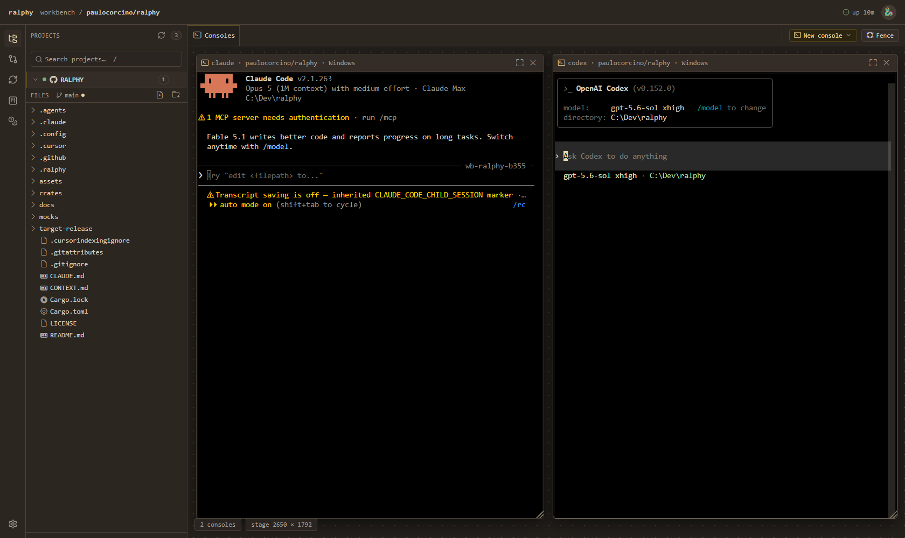

# Ralphy 🌙

[](https://www.rust-lang.org/)
[](https://github.com/paulocorcino/ralphy/releases)
[](LICENSE)
[](https://claude.com/claude-code)

**Your coding agents, your repos, your machine — in a browser tab you can open from anywhere.**



Ralphy is one small binary that turns the computer where your code lives into a workspace
you can reach from any other screen. It runs a resident **daemon** on your box and serves a
**workbench**: projects, a file explorer with a real editor, your git changes, your issue
board, live runs, spend — and **real agent terminals** (Claude, Codex, OpenCode, Copilot,
Cursor, Gemini, Kimi) side by side in one tab.

The terminals belong to the daemon, not to the browser. Close the laptop, pick up the
tablet, open the same URL: the sessions are still running, with their scrollback, **and your
window layout comes back with them**.

And when you're done for the day, the same binary can work your backlog while you sleep.

```text
     🏠 your machine                      🌍 any screen you happen to have
┌───────────────────────────┐          ┌──────────┐ ┌──────────┐ ┌──────────┐
│  ralphy daemon            │          │ desktop  │ │ notebook │ │  tablet  │
│  · your repos             │  ◀────▶  │          │ │          │ │  / phone │
│  · your agent sessions    │          └──────────┘ └──────────┘ └──────────┘
│  · your gh login          │             one workbench, same sessions,
└───────────────────────────┘                 same layout, no upload
```

Three things worth knowing up front:

- 🔒 **Nothing is uploaded anywhere.** The daemon runs on *your* box, binds to loopback by
  default, and reads the same repos and the same `gh` login you already use.
- 💳 **No API key, no per-token bill.** Ralphy drives the agent CLIs you're already signed
  into, on the **subscription** you already pay for.
- 💻 **Windows, Linux, and macOS**, one binary, no runtime to install.

---

## 🚀 Get it running

### 📦 1 — Get the `ralphy` binary

Grab the archive for your platform from the
[**Releases page**](https://github.com/paulocorcino/ralphy/releases) — Windows, Linux, or
macOS (Intel & Apple Silicon) — unzip it anywhere, then let it put itself on your `PATH`:

```bash
./ralphy install
```

Already have it? `ralphy update` takes the newest release: it checks the published
checksum, replaces the binary in place, and restarts the daemon if one is running.
`ralphy update --check` just tells you what is new.

*(Prefer to build from source? See [docs/BUILDING.md](docs/BUILDING.md).)*

### ✅ 2 — The basics you'll need

- 🤖 **At least one coding-agent CLI, signed in.** That's the brain behind the terminals and
  the runs. [Claude Code](https://claude.com/claude-code) is the default; Codex, OpenCode,
  Copilot, Cursor, Gemini and Kimi work too.
  → [which agents, and how to pick one](docs/agents.md)
- 🐙 **The `gh` CLI, logged in** — needed for the issue board and the overnight run. Check
  with `gh auth status`. (Not using GitHub? The consoles, explorer and changes panels work
  without it.)

No API keys anywhere.

### 🖥️ 3 — Start the workbench

```bash
ralphy daemon setup     # baptize it: pick a name and an avatar, mint an access token
ralphy daemon add .     # register the repo you're standing in (repeat per project)
ralphy daemon           # run it — then open http://127.0.0.1:7257
```

Want it up whenever you log in? `ralphy daemon install` registers it with your OS (Task
Scheduler on Windows, a systemd **user** unit on Linux/WSL), and `ralphy daemon uninstall`
takes it back out. → [docs/daemon.md](docs/daemon.md)

---

## 🧰 What's in the workbench

- 🗂️ **Projects** — every repo you registered, in one accordion: branch, dirty state, and
  whether it has a GitHub remote.
- 📁 **Explorer** — the real file tree, with a real editor (Monaco): open, read, edit, save.
  Images render inline.
- 🖥️ **Consoles** — actual agent CLIs running as terminals on a pannable stage. Group them
  into **fences**, or pop a fence out into its own window for a second monitor.
- 🧩 **Board** — your AFK/HITL backlog as a kanban. Open an issue, read it, and send it to a
  run without leaving the page.
- ▶️ **Runs** — the loop, live: which issue is being worked, which phase it's in (planning,
  executing, verifying), and what it cost.
- 🌿 **Changes** — the working tree: read the diff, stage, commit, fast-forward pull, and
  push when *you* say so.
- 📊 **Spend** — the token ledger and a dollar estimate, per run, per model, per project.
- 🛰️ **Fleet** — two daemons, one workbench: a WSL box (or a second machine) shows up as a
  peer, with its repos and its consoles.

Two consoles of the same repo on two screens is the point: **you** drive one agent by hand
while Ralphy's run works the queue in the other.

### 📱 Reaching it from the couch, the office, or a tablet

The workbench is a web app on your own machine, so anything that can reach that machine can
open it. Two ways, in order of least surprise:

- **On your own network** — bind it to a LAN address: `ralphy daemon --bind 0.0.0.0`. A
  non-loopback bind **requires** the access token minted by `ralphy daemon setup`, or the
  daemon refuses to start.
- **From anywhere** — put a tunnel in front of it (dev tunnels, ngrok, Cloudflare Tunnel).
  Tunnels that preserve the original hostname need you to declare it:
  `ralphy daemon --allowed-host my-tunnel.example.dev`. Declare the exact name, never a
  wildcard — that is what keeps DNS rebinding out.

Once it's reachable beyond loopback, turn on **require-login**: a password plus TOTP 2FA,
enrolled from the Security panel with a QR you scan once. It's opt-in on purpose — Ralphy
never decides for you how reachable your machine should be.
→ [docs/daemon.md](docs/daemon.md)

---

## 🌙 The overnight run

The other half of Ralphy: point it at your GitHub issues and let it work them while you're
asleep. For each issue it **plans** the work, lets an agent **write the code**, **commits**,
**re-runs the tests itself**, and **closes** the issue if they pass. In the morning you skim
the branch and merge what you like.

That's [Geoffrey Huntley](https://ghuntley.com/ralphy/)'s "Ralph" loop —
*plan → execute → commit → verify → repeat* — as a batteries-included implementation over
your real issues, with guardrails so it's safe to leave running.

### 🏷️ Two labels decide everything

- 🟢 **`AFK`** (or `ready-for-agent`) — *"away from keyboard, agent go."* It joins the queue.
- 🔴 **`HITL`** (or `ready-for-human`) — *"human in the loop."* Ralphy never touches it.

Unlabeled issues are ignored. A few more labels fine-tune things (triage, staged plans,
"stop before this one"), but those two are the daily driver.
[The full label rules →](docs/adr/0016-queue-label-precedence.md)

### ▶️ Build trust one step at a time

```bash
ralphy init                              # guided setup: environment check, labels, repo prep

ralphy run --only-issue 13 --dry-run     # 1️⃣  plan one issue — no code, no commits
ralphy run --only-issue 13               # 2️⃣  actually do that one
ralphy run --deadline-hours 8            # 3️⃣  the whole queue, overnight
```

Once you trust it, this is the everyday shape of a run:

```bash
ralphy run --agent <agent> --branch-mode <current|new>
```

- 🤖 **`--agent`** — *who writes the code.* Same issues, different brain.
  → [see all agents](docs/agents.md)
- 🌿 **`--branch-mode`** — *where the commits land.* `new` (default) cuts a fresh
  `afk/run-<stamp>` branch so the branch you're on stays untouched; `current` commits right
  onto the branch you're already on. Either way Ralphy refuses to start on a dirty repo.

📖 Every other flag — deadlines, planning models, stopping before an issue — lives in the
[**run options reference**](docs/run-options.md), and `ralphy run --help` prints the same
list. ⏰ Want it on a timer? → [docs/scheduling.md](docs/scheduling.md)

### 💡 Turning an idea into a backlog

Ralphy works *issues*, so first you need some. Inside your agent, go from fuzzy to ready in
three moves: **`grill-with-docs`** (co-author a short doc so the agent really understands
what you want) → **`to-prd`** (shape it into a spec) → **`to-issues`** (split it into small,
independent, labeled issues). `ralphy init` can install those skills for you.

### 🌅 The morning after

```bash
git log --oneline origin/main..afk/run-<stamp>     # see what landed
git diff origin/main..afk/run-<stamp>

# 👍 Happy? Merge it.        # 👎 Not happy? Delete the branch —
git checkout main            #     your main was never touched.
git merge afk/run-<stamp>    git branch -D afk/run-<stamp>
```

Or just open the **Changes** panel in the workbench and read the same diff there.

### 🛡️ Why it's safe to leave running

- 🧹 **Won't start on a dirty repo** — your uncommitted work is never at risk.
- 🚫 **The run never pushes and never opens a PR** — it commits locally. Pushing is a
  deliberate act *you* take, from the workbench or the shell.
- ⏱️ **Time budgets** — a hung issue can't run forever.
- 🛑 **Stops at the first failure** — one stuck issue ends the run instead of burning the
  whole night, and hands you the branch as-is.
- ✅ **Runner-enforced tests** — an issue closes only when Ralphy *itself* watched the tests
  pass. → [docs/verify-gate.md](docs/verify-gate.md)
- 🧯 **Command guardrails** — destructive commands like `git push` and `reset --hard` are
  blocked mid-run.

---

## 📲 Keep an eye on it from your phone (optional)

Ralphy can post a live **status card** to a Telegram chat and keep it updated the whole way
through — planning, coding, and the final summary. It's read-only; the bot just tells you
how things are going.

```bash
ralphy telegram setup    # store your bot token, then send /start to link your chat
ralphy telegram test     # send a ping to confirm it works
```

[More on the Telegram monitor →](docs/telegram.md)

---

## 📚 More you can do

| Feature | What it's for | Start here |
|---|---|---|
| 🖥️ **The daemon & fleet** | autostart, WSL peers, reaching it remotely | [docs/daemon.md](docs/daemon.md) |
| 🤖 **Choose your agent** | seven vendors — even plan with one and code with another | [docs/agents.md](docs/agents.md) |
| 🔍 **The verify gate** | why "green" means *the tests actually passed*, not *the agent said so* | [docs/verify-gate.md](docs/verify-gate.md) |
| 📊 **Cost reporting** | tokens per run, with a $ estimate | [docs/usage-and-cost.md](docs/usage-and-cost.md) |
| ⚙️ **Persistent settings** | stop retyping the same flags every run | [docs/configuration.md](docs/configuration.md) |
| ⏰ **Scheduled runs** | drain the queue nightly on a timer | [docs/scheduling.md](docs/scheduling.md) |
| 📡 **Event streaming** | POST every run event to a dashboard or webhook | [docs/events.md](docs/events.md) |
| 🧠 **Knowledge cache** | Ralphy remembers hard-won setup facts across runs | `ralphy consolidate --help` |
| 🏗️ **Architecture** | ports & adapters — the decisions, and why | [docs/adr/](docs/adr/) |

---

## 🙏 Credits

- **The Ralph loop** — the unattended plan-execute-commit pattern is
  [Geoffrey Huntley](https://ghuntley.com/ralphy/)'s.
- **Triage vocabulary** — the labels (`ready-for-agent`, `ready-for-human`, …) are
  **[Matt Pocock](https://github.com/mattpocock)'s**, from his
  [engineering skills](https://github.com/mattpocock/skills/tree/main/skills/engineering/setup-matt-pocock-skills).

## 📄 License

GPLv3 — see [LICENSE](LICENSE). Copyright (C) 2026 Paulo Corcino.
