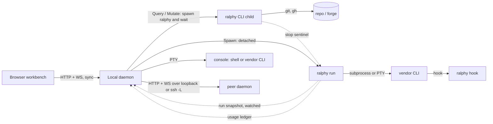

# Architecture

This is the map of Ralphy's architecture. It points to the decisions in
[docs/adr/](./adr/) and to the words in [CONTEXT.md](../CONTEXT.md); it does
not repeat them. When this file and an ADR disagree, the ADR is correct: fix
this file.

## 1. How to use this file

Read §6 and §7 **before** you add any of these:

- a call to an outside service or tool (`gh`, an HTTP API, a vendor CLI);
- a new I/O path between the browser, the daemon and the CLI;
- a watcher or a timer;
- a new panel, or a new place in the workbench that shows a fact (a **shown
  fact**: add its row to §7, with the events that read it again);
- a second way to compute a fact that the product already knows.

Read §9 and [ADR-0072](./adr/0072-the-security-model.md) **before** you add
a path across a trust boundary, a flag or setting that changes what an agent
or a client may do, a secret, or a vendored library.

If §7 names an owner for the fact, get it from that owner. If the fact is not
in §7, it has no owner yet: say so in your plan, and name the one owner you
propose. If a rule in §5 blocks your change, the answer is a decision: an ADR
or an amendment.

The template for a new decision is [adr/TEMPLATE.md](./adr/TEMPLATE.md).

## 2. Constraints and characteristics

**Constraints.** These are never traded against anything:

- **Portability.** Windows, Linux and macOS, all built and tested in CI.
- **Security.** The strongest option is the recommended default, but it is
  opt-in. Ralphy never takes a capability away from the operator. The trust
  zones and the premises are in
  [ADR-0072](./adr/0072-the-security-model.md); the boundaries are in §9.

**Architecture characteristics.** The first three decide trade-offs. When two
of them conflict, the one higher in the list wins, unless an ADR says
otherwise.

| # | Characteristic | Meaning in Ralphy |
|---|---|---|
| 1 | **Recoverability of an unattended run** | The queue keeps moving with no human: limits, idle children, stop, resume. |
| 2 | **Integrity of change** | "Green" means the runner saw the check pass, not that the agent said so. Ralphy never pushes a branch or opens a PR on its own. |
| 3 | **Consistency of the workbench** | What the screen shows is true when it is shown. Stale data is read again on named events. A failed read shows as a failure, never as empty or clean. |
| 4 | Extensibility | New agent vendors, event sinks, hosts and workbench features enter without rework (§6). |
| 5 | Observability and cost | Events, the run snapshot, tokens, prices applied at read time. |
| 6 | Testability | Seams with fakes; every new test is seen red. |
| 7 | Responsiveness of the workbench | Watchers, not polling; no work per request that could be avoided. It limits *how* the workbench reads again, not *whether*. |
| 8 | Operability | Init, install, update, and plain UI text. |

An ADR names the characteristic it protects in its `Protects:` line.

## 3. Style and runtime units

Ralphy is a **modular monolith**: one Rust workspace, one binary. For agents it
is a **microkernel**: `ralphy-core` is the kernel, each `ralphy-agent-*` crate is
a plug-in, and [ADR-0040](./adr/0040-agent-adapter-onboarding-contract.md) is
the plug-in contract. At the crate boundary it is **ports and adapters**
([ADR-0002](./adr/0002-core-agnostic-adapter-boundary.md)).

At runtime the one binary becomes five units that run on their own:

| Unit | Talks to | How |
|---|---|---|
| Browser workbench | daemon | Synchronous HTTP and WebSocket, through the verb registry ([ADR-0036](./adr/0036-workbench-daemon-integration-protocol.md)) |
| Daemon | CLI children, peers, consoles | Spawns `ralphy` for anything that interprets or changes a repo ([ADR-0032](./adr/0032-daemon-mode-supervised-launcher.md), ADR-0036 §3) |
| Run | daemon | **Asynchronous only**: run snapshot, stop sentinel, run lock, ledger ([ADR-0047](./adr/0047-run-state-snapshot-channel.md), [ADR-0054](./adr/0054-cooperative-run-stop.md)) |
| Peer daemon | daemon | Synchronous, versioned peer protocol ([ADR-0052](./adr/0052-local-fleet-federation.md), [ADR-0067](./adr/0067-peers-on-other-machines-through-ssh.md)) |
| Console CLI | daemon | A byte stream on a PTY; lives and dies with the daemon |

Inside the browser workbench, the first-party script is TypeScript
modules; only the vendored libraries are classic scripts
([ADR-0075](./adr/0075-the-workbench-script-is-written-in-typescript.md)).
The daemon's `build.rs` removes the types and the binary embeds the
result. A module exports, and sets a `window.WB<Name>` name only while
markup, another page or a browser check reads it there. Each page loads one
entry module, which imports the rest and creates the page's instances
(`main.ts` for the workbench). The `shell()` Alpine
component in `app.ts` holds the page layout and, for now, most features. A
feature with its own state moves out of it into an Alpine component in its
own file, one feature at a time
([ADR-0073](./adr/0073-the-workbench-script-is-cut-into-alpine-components.md)).
The Hosts dialog (`wb-hosts-dialog.ts`) is the first one, and the first
module.

## 4. Components and crates

The component names are CONTEXT.md terms.

| Component | Crate / module |
|---|---|
| Queue, Run, Planner / Executor, Verify gate | `ralphy-core` (`runner`, `blocked`, `verify`, `plan`, `handoff`) |
| Agent contract (the port) | `ralphy-core::agent` |
| Adapter | one `ralphy-agent-*` crate per vendor |
| Adapter support, Outcome classifier | `ralphy-adapter-support` |
| Forge access | `ralphy-core::github` (the only GitHub code; see §6) |
| Change set, Sync status, Working-tree operations | `ralphy-core` (`changes`, `sync`, `worktree`, `git`) |
| Read-only git facts | `ralphy-git-read` |
| Event bus, Event sink | `ralphy-core::emit`; sinks in `ralphy-cli` (`ui`, `telegram`, `events`) |
| Run snapshot | `ralphy-run-snapshot` (format); written by `ralphy-cli`, read by `ralphy-daemon` |
| Usage ledger, Priced usage, Usage scan | `ralphy-core::ledger`, `ralphy-pricing`, `ralphy-usage-scan` |
| Settings | `ralphy-core::settings` |
| Daemon verb registry, file tree, consoles, desk, auth, fleet | `ralphy-daemon` |
| Release watch | `ralphy-release` |
| Composition root (names every vendor, wires everything) | `ralphy-cli` |
| Workbench UI | `crates/ralphy-daemon/assets/ui/` |
| Process and PTY helpers | `ralphy-proc-util`, `ralphy-pty` |

## 5. Allowed edges

"Check" names the code that fails when the rule breaks. "None" is a known gap.

| Rule | Decided by | Check |
|---|---|---|
| `ralphy-core` depends on no `ralphy-agent-*` crate and not on `ralphy-adapter-support` | ADR-0002 | `core_and_adapters_keep_their_dependency_edges` (`crates/xtask/tests/crate_dependencies.rs`) |
| No adapter depends on another adapter | ADR-0002, ADR-0040 | the same test |
| `ralphy-pricing` and `ralphy-release` are leaf crates | ADR-0034, ADR-0056 | the same test |
| `ralphy-git-read` is a leaf crate | ADR-0069 | the same test |
| The daemon links no vendor crate and does not import `ralphy-core` | ADR-0032 §10 | `daemon_manifest_has_no_vendor_dependency` (`crates/ralphy-daemon/src/roster.rs`); the core half has none yet |
| No `tokio` or `reqwest` in the CLI; the async stack stays in the daemon | ADR-0032 | `cli_manifest_pins_ureq_excludes_reqwest_tokio` (`crates/ralphy-cli/src/pricing.rs`) |
| The daemon may observe the working tree as bytes; anything that interprets or changes a repo is a `ralphy` invocation, except read-only git facts through `ralphy-git-read` (ADR-0069) | ADR-0036 §3 | None yet |
| The daemon reads git facts only through `ralphy-git-read`, and runs no git of its own | ADR-0069 | `spawn_sites_match_the_baseline` (`crates/xtask/tests/ratchets.rs`): its baseline has zero sites in `crates/ralphy-daemon/src` and `crates/ralphy-usage-scan/src`; `every_read_is_on_the_read_only_list` (`crates/ralphy-git-read/src/lib.rs`) for the read-only half |
| The browser reaches only the daemon, and a new capability is a verb in the registry, not a new route | ADR-0036 §1 | The CSP's `connect-src 'self'` (`crates/ralphy-daemon/src/routes/headers.rs`), held by `every_response_carries_the_security_headers` (`crates/ralphy-daemon/src/tests.rs`); the verb half has no check yet |
| Run → daemon is asynchronous only | ADR-0047, ADR-0054 | Behaviour tests only |
| Only the event vocabulary in `core::emit` reaches the decoders | ADR-0039 | `every_decoder_arm_has_a_pin` (`crates/ralphy-cli/src/runstate/capture/tests.rs`) |

## 6. External dependencies

[ADR-0068](./adr/0068-external-products-stay-behind-ralphy-contracts.md)
sorts every outside dependency into three classes.

**Replaceable products.** A product's meaning lives only in its adapter. Code
outside the adapter uses Ralphy's words.

| Product | Adapter (the only place its meaning may live) | Known coupling outside it (contained, must not grow) |
|---|---|---|
| GitHub, as the **Forge** | `ralphy-core::github` | the `ralphy_core::github::` items used from `ralphy-cli` (the forge ratchet in §8 holds the count); label names and body conventions in `runner`, `acceptance`, `blocked`; `gh issue view` in the prompts |
| Agent CLIs | one `ralphy-agent-*` crate each | vendor reset-time formats parsed in `ralphy-core/src/runner/clock.rs`; the vendor enums the ADR-0040 inventory lists |
| models.dev | `ralphy-pricing` | — |
| Telegram | `ralphy-cli/src/telegram` | — |
| GitHub Releases (Ralphy's own distribution) | `ralphy-release` | — |

**Platforms.** An open standard, used directly, but by one owner.

| Platform | Owner |
|---|---|
| git | `ralphy-core` for anything that changes a repo; `ralphy-git-read` for read-only facts ([ADR-0069](./adr/0069-git-facts-have-one-definition.md)) |
| ssh | the **Peer tunnel** (`ralphy-daemon/src/peer`) and `ralphy host` (`ralphy-cli/src/host`) |
| PTY | `ralphy-pty` |
| OS schedulers and service managers | `ralphy-cli` (`schedule`, `daemon`) |
| HTTP, CloudEvents | the component that owns the call (`ureq` in the CLI, `axum`/`hyper` in the daemon) |

**Extension points.** Agent vendor (ADR-0040), event sink (a `tracing` layer
in the CLI; core only emits), host and peer (ADR-0052, ADR-0067), and a
workbench feature (a verb in the registry, ADR-0036). The forge is **not** an
extension point: it follows the product rule until a second forge is real.

## 7. Fact index

Where each fact lives, how to get it, and where it must **never** come from.
Verbs are daemon verbs; subcommands are `ralphy` subcommands.

"Read again on" applies to a **shown fact** (CONTEXT.md) and uses the event
numbers of [ADR-0070](./adr/0070-the-workbench-shows-only-what-it-has-read.md)
D2: 1 push from the owner, 2 the socket opens again, 3 the tab becomes
visible, 4 login, 5 the reply to the operator's own action, 6 a periodic read
while the tab is visible, 7 a read of a peer project failed (peer state only). Every shown fact reads when its panel opens. A new
panel adds its row here before it adds code.

| Fact | Owner | How to get it | Never from | Read again on |
|---|---|---|---|---|
| Issue state, labels, open issues | Forge access (`ralphy-core::github`) | `ralphy issues --format json [--board]`; verbs `board.list`, `issue.show` | a new `gh` call outside the adapter; label rules re-written in the UI | 2, 3, 4, 5; 6 every 120 s (the forge cannot push) |
| Queue order, blocked-by | `ralphy-core::blocked` | the queue snapshot (`ralphy issues`) | a re-sort in the UI | with the board |
| **Change set**, dirty tree | `ralphy-core::changes`; the dirty bit on `/api/repos` is `ralphy-git-read::dirty`, by the same `.ralphy/` rule | `ralphy changes list --format json`; verb `changes.list` | a second `git status` | 1 `changes.dirty`, 2–5; 6 every 50 s while the Changes panel is open, because an edit made outside a run has no push yet |
| Current branch (**Sync status**) | `ralphy-git-read` (`Head`, re-exported by `ralphy-core::sync`) | `ralphy sync status --format json`; verb `sync.status`; `head.dirty` push; `head` on `/api/repos` | reading `.git/HEAD` yourself | local repo: 1 `head.dirty`, 2–5. Peer repo: 2–5, and 6 with the Changes panel (no `head.dirty` from peers) |
| **Ignored path** | display: the daemon file tree (`tree/ignored.rs`); acting on files: `git check-ignore` in core | display: verb `tree.list`, field `ignored`; files: the core carry | the forge (`gh` has no view of the working tree) | with the tree |
| File tree and file contents | the daemon file tree (`ralphy-daemon/src/tree.rs`) | verbs `tree.list`, `tree.find`, `tree.grep`, `file.read`; `tree.dirty` push | a walk from the UI | 1 `tree.dirty`, 2–4 |
| Run state | the **Run snapshot** (`.ralphy/runstate/<runid>.json`) | verb `runs.list`; `runs.dirty` push | parsing run logs or console output | 1 `runs.dirty`, 2–4 |
| Token usage | the ledger (`~/.ralphy/usage/`) for runs; the **Usage scan** for interactive use | `ralphy usage`; `/api/usage`, `/api/spend` | a stored USD value | 3, 4 |
| Price of a model | `ralphy-pricing`, applied at read time | `ralphy usage`, the Spend view | a price written into the ledger | with token usage |
| Settings | `ralphy-core::settings` (`.ralphy/settings.json`) | `ralphy config get --json`; verb `config.get` | a new reparse in the daemon (three exist, each pinned by a test) | 3, 4, 5 |
| Desk layout | the daemon (`desk.rs`; a PUT is a list of **desk changes** applied by `desk/apply.rs`, and each reply carries `rev`) | `GET` / `PUT /api/desk`; the browser sends changes only through `wb-desk-sync.ts` | browser storage (only the per-client view lives there, `wb-view.ts`); a whole record or a whole desk in a PUT | 1 `desk.dirty`, 2–5 |
| **Desk history** | the daemon (`desk/history.rs`) | `GET` / `POST /api/desk/history` | a copy of the desk kept in the browser | when the Settings section opens; 5 |
| Consoles, console agent state | the daemon (`session/`, `agent_state.rs`) | `/api/sessions` (its header `x-ralphy-unanswered` names the peers the list did not hear from), the presence socket | a peer missing from the list read as "no sessions there" | 1 `sessions.dirty`, 2–4; 6 every 30 s while a peer is listed (peers do not push their sessions); a `working` that ages into `unknown` pushes too |
| Projects, peers and their state; the project name; the open project | the daemon (`registry.rs`, `peer/`, `fleet.rs`); the name is `registry::project_name`. In the page, the Alpine store `projects` holds the list and the open project: it is written only by its own methods and read by every part of the page (ADR-0073) | `/api/repos`, `/api/fleet`; the field `name` | a name worked out in the UI from the slug or the path | 1 `repos.dirty` / `peers.dirty` (the daemon stats its stores every 2 s), 2–5; 6 every 30 s while a peer is listed (peer reachability); 7 a read of a peer project failed (peer reachability) |
| **Devices** and the **audit log** | the daemon (`audit.rs`, `device.rs`) | `GET /api/audit/devices`, `GET /api/audit/events`; the `/ws/command` verbs that change state, and the console launches and take-overs on `/ws/session`, are recorded by the daemon itself; the page reports its facts once per load to `POST /api/device/facts` (`wb-device.ts`) | a device list kept in the browser; an address lookup service (ADR-0074 D7) | when the Settings section opens; 4 |
| Ralphy release version | `ralphy-release` | `/api/release`; the build id in the presence frame (ADR-0070 D6) | — | 3; a build id that differs reloads the tab (D6) |

## 8. Fitness functions

A fitness function is a check that fails when the architecture breaks, for
any code, including code that does not exist yet. A behaviour test is not one.

**In place:**

| Rule | Check |
|---|---|
| The daemon links no vendor crate | `daemon_manifest_has_no_vendor_dependency` |
| No `tokio`/`reqwest` in the CLI | `cli_manifest_pins_ureq_excludes_reqwest_tokio` |
| Event vocabulary pinned | `every_decoder_arm_has_a_pin` |
| Inline test module size | `crates/xtask/tests/inline_test_modules.rs` (ADR-0022 §6) |
| Files over 500 lines of code are seen (a recommendation, not a gate) | `cargo run -p xtask -- oversized` lists them; the `oversized` CI job warns, never fails, on each one a pull request touches (ADR-0022) |
| Text a user reads cites no ADR | `crates/xtask/tests/user_text_cites_no_adr.rs`, `no_help_text_cites_an_adr` |
| UI written voice | `cargo run -p xtask -- ui-copy --check` (ADR-0065) |
| Changelog fragments parse | `cargo run -p xtask -- changelog --check` (ADR-0056) |
| UI asset contract | `node --test crates/ralphy-daemon/ui-tests`, oxlint (ADR-0057) |
| Workbench modules type-check, and no first-party classic script comes back | `tsc --noEmit -p crates/ralphy-daemon/assets/ui`; `first_party_scripts_move_to_typescript_and_never_back` (`crates/ralphy-daemon/src/tests.rs`), with `CLASSIC_SCRIPTS` empty and `MODULE_WINDOW_NAMES` as ratchets (ADR-0075) |
| UI settings mirror matches the Rust keys | the `WB_SETTINGS` test in `crates/ralphy-daemon/src/tests.rs` |
| Core names no vendor crate; no adapter depends on another; `ralphy-pricing` and `ralphy-release` are leaf crates | `core_and_adapters_keep_their_dependency_edges` (`crates/xtask/tests/crate_dependencies.rs`) |
| `git`, `gh` and `ssh` are spawned only by their owners (§6) | `spawn_sites_match_the_baseline` (`crates/xtask/tests/ratchets.rs`), a ratchet on literal `Command::new("git" \| "gh" \| "ssh")` sites |
| `ralphy-git-read` runs only read-only git commands | `every_read_is_on_the_read_only_list` (`crates/ralphy-git-read/src/lib.rs`), ADR-0069 D2 |
| The forge does not spread | `forge_use_matches_the_baseline` (`crates/xtask/tests/ratchets.rs`), a ratchet on the `github::` items used in `ralphy-cli` and on `gh issue view` in `assets/prompts/` |
| A new ADR has a closed-set status and kind and, if structural, a Compliance section | `new_adrs_have_a_closed_status_and_kind` (`crates/xtask/tests/adr_map.rs`), from ADR-0068 on |
| This file stays true | `the_architecture_map_cites_real_adrs_and_every_structural_one` (`crates/xtask/tests/adr_map.rs`): every ADR cited here exists, and every structural ADR from ADR-0068 on is cited |
| The browser and the daemon agree on each reply | shared replies in `crates/ralphy-daemon/ui-tests/fixtures/`, written by the Rust tests (`tests/support/golden.rs`) and read by `ui-tests/shared-replies.test.mjs`; `message_types_without_a_shared_reply_match_the_baseline` (`crates/xtask/tests/ui_contract.rs`), a ratchet on message types without one (ADR-0070) |
| Every error text the UI compares is one the Rust code produces | `every_error_literal_the_ui_compares_is_produced_by_rust` (`crates/xtask/tests/ui_contract.rs`, ADR-0070) |
| A limit repeated in the UI equals its Rust constant | `every_mirrored_limit_equals_its_rust_constant` (`crates/xtask/tests/ui_contract.rs`, ADR-0070) |

A **ratchet** records today's count of known violations and fails when the
count changes. It does not force fixing everything at once. When a count goes
down, the same change lowers the baseline, so the count cannot grow back.

The diagnosis behind this map, with the evidence and the full list of gaps,
is [architecture-diagnosis-2026-09-30.md](./architecture-diagnosis-2026-09-30.md).

## 9. Trust boundaries

Each row is a place where data or control enters from a less trusted zone
([ADR-0072](./adr/0072-the-security-model.md)). A new path across a zone
needs a row here before it has code. "Control" names the code that holds the
boundary.

| Boundary | What crosses | Control | Decided by |
|---|---|---|---|
| Network client → daemon | HTTP and WebSocket requests | The auth guard (`ralphy-daemon/src/routes/guard.rs`): Host and Origin, then the policy, then the session | ADR-0032 |
| Workbench → audit log | **Device facts** the page reports about itself | A fixed shape with a size cap (`routes/api_audit.rs`); facts are recorded with source `client` and no access decision reads them | ADR-0074 |
| Workbench → repo | Verbs from the browser | The verb registry and argv shape checks (`dispatch.rs`, `dispatch/argv.rs`); path confinement (`confine.rs`, `fswrite.rs`) | ADR-0036 |
| Peer daemon → daemon | Verbs and sessions from a peer | The peer's bearer token, dialled on loopback or through `ssh -L` only | ADR-0052, ADR-0067 |
| Forge → prompt | Issue body, comments, attachments | The label gate; the comment trust filter (`ralphy-core/src/github/comments.rs`); the charters | ADR-0032 (H), ADR-0072 D5 |
| Agent → repo and forge | Tool calls of the vendor CLI | The guard hook (`ralphy-cli/src/guard.rs`) or the vendor's deny policy; the verify gate | ADR-0072 D6, ADR-0011, the adapter's ADR |
| Ralphy → child process | Environment and argv | The environment scrub of each spawn site | ADR-0072 D7 |
| Outside service → Ralphy | Releases, prices, vendor answers | The owner in §6: HTTPS, timeout, size cap, shape check | ADR-0068, ADR-0072 D9 |
| Release → operator's machine | A new binary | SHA-256 check before replace; step-up from the workbench | ADR-0056 |
| Upstream → workbench assets | Vendored browser libraries | CODEOWNERS review, `xtask capabilities`, a recorded version and hash | ADR-0057, ADR-0072 D12 |
