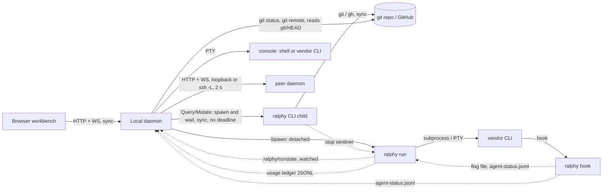

# Architecture diagnosis — 2026-09-30

This document is a diagnosis, not a design. It records how Ralphy is built
today, how that compares with what the ADRs decided, and where the gaps are.
It is the input for a future `docs/ARCHITECTURE.md` and for the fitness
functions that will keep that document true.

## Why this diagnosis exists

Agents write most of Ralphy's code. An agent sees the file it edits, not the
whole system. Two failures follow from that:

- **Wrong source for a fact.** An agent proposed the `gh` CLI to find which
  files a `.gitignore` covers. The daemon already computes that mark
  locally. Nothing told the agent which component owns the fact.
- **A shortcut across a boundary.** A component reaches something it should
  reach only through another layer, and no check stops it.

Both come from the same cause: the rules exist, but they are spread over 67
decisions in `docs/adr/`, and most of them are not checked by code.

## Method

The frame is from Mark Richards and Neal Ford:

- *Fundamentals of Software Architecture*, 2nd ed. (2025). Architecture has
  four dimensions: **characteristics** (the "-ilities"), **decisions**,
  **logical components**, and **style**. Three laws: everything is a
  trade-off; *why* matters more than *how*; most decisions sit on a spectrum,
  not at one of two ends.
- *Software Architecture: The Hard Parts*. **Static coupling** (contracts,
  dependencies) and **dynamic coupling** (runtime calls). The **architecture
  quantum**: a unit that runs and deploys on its own.
- *Building Evolutionary Architectures*, 2nd ed. A **fitness function** is any
  mechanism that objectively checks an architecture characteristic. Automated
  fitness functions are how architecture is governed.
- **Connascence** (used in both books) grades coupling by strength (name <
  type < meaning < algorithm; execution < timing < identity), by locality,
  and by degree.

Five read-only recovery passes ran in parallel on branch `fix/bugs-20260930`
(HEAD `358c296d` plus local fixes): static structure, dynamic coupling,
logical components and fact ownership, the UI↔daemon contract, and an audit
of every ADR. Counts that depend on a grep state the pattern in the appendix.

**What was checked by hand, and what was not.** Checked again by hand: the
daemon's git spawns and HEAD read, the usage-scan git spawns, the 50 s
Changes poll, ADR-0036's status and line 923, the CONTEXT.md "no `Outcome`"
line, the 24 `github::` items in 9 CLI files, the fail-open tracker defaults,
the `runner`↔`github` cycle, the vendor reset parsing in `clock.rs`, the `gh
issue view` lines in the prompts, and the 0 Compliance sections. **Not**
checked again: the Martin metrics, the 12 status drifts (only ADR-0036 was
checked), and the per-ADR characteristic and compliance tags. Those tags are a
reviewer's judgment, not a measurement. The risk ratings in §8 are estimates.

## Decisions taken so far

These come from the owner, in the interview that goes with this diagnosis.

**Constraints.** These are never traded against anything, so they are not
characteristics:

- **Portability.** Windows, Linux and macOS, all tested in CI.
- **Security.** The strongest option is the recommended default, but it is
  opt-in. Ralphy never takes a capability away from the operator.

**Architecture characteristics.** At most seven, and the first three decide
trade-offs:

| Role | Characteristic | Meaning in Ralphy |
|---|---|---|
| Decides trade-offs | 1. **Recoverability of an unattended run** | The queue keeps moving with no human: limits, idle, stop, resume. |
| Decides trade-offs | 2. **Integrity of change** | "Green" means the runner saw it pass, not that the agent said so. Ralphy never pushes or opens a PR. |
| Decides trade-offs | 3. **Extensibility** | New vendors and new surfaces enter without rework. The axes are still open (see below). |
| Named and measured | 4. Observability and cost transparency | Events, run snapshot, tokens, read-time price. |
| Named and measured | 5. Testability | Seams, fakes, the "seen red" rule. |
| Named and measured | 6. Responsiveness of the workbench | Watchers, not polling. No work per request that could be cached. |
| Named and measured | 7. Operability | Init, update, install, plain UI text. |

**External dependencies, three classes** (decided):

| Class | Examples | Rule |
|---|---|---|
| **Replaceable product** (a vendor's service that has competitors) | GitHub as forge, agent CLIs, models.dev, Telegram, GitHub Releases as the distribution channel | Behind a contract in Ralphy's words. All of the product's meaning lives only in its adapter. |
| **Standard or platform** (an open protocol with no vendor) | git, ssh, HTTP, CloudEvents, PTY, OS schedulers | Used directly, but by **one owner** only (git only through repo semantics; ssh only through the peer tunnel). |
| **Library** | crates, Monaco, xterm, Alpine | Normal dependency rules. Outside this principle. |

"Strong coupling" is defined by connascence. Across a boundary with a
product, only connascence of name and type **in Ralphy's words** is allowed
(`IssueId`, "close the issue"). Connascence of meaning or algorithm that
belongs to the product ("the queue is a label", "the id is a `u64`", "tick a
checkbox in the body", "run `gh`") stays inside the product's adapter.

**Extension axes:** agent vendor, event sink, host/peer, and workbench
surface (through the verb registry). The forge follows the product rule
above.

**How the product rule is applied** (decided, 80/20): the rule applies to
new code at once, through a ratchet. An `xtask` check counts the uses of
`ralphy_core::github::` outside the adapter (today 24 items in 9 CLI files)
and fails when the count goes up. Existing coupling is recorded and
contained, not refactored, until a second product is real or the code is
touched for another reason. The one fix made now protects integrity:
`IssueTracker::is_closed` and `create_issue` lose their fail-open defaults
and become required. Rejected for now: extracting a `ralphy-forge-github`
crate, which costs weeks for a second forge that is not planned. This follows
the anti-over-abstraction rule in AGENTS.md.

**Owner of git** (decided): one definition, two processes. A new read-only
leaf crate, `ralphy-git-read`, holds head, dirty (change-set rule), origin
URL, `.git` pointer resolution and `user.email`. Core, the daemon and
usage-scan use it; the daemon runs no git of its own. Written as
[ADR-0068](adr/0068-external-products-stay-behind-ralphy-contracts.md) (the
three classes, the product rule, the ratchet) and
[ADR-0069](adr/0069-git-facts-have-one-definition.md) (git), both proposed.

**"Ignored" vocabulary** (decided): CONTEXT.md now defines **Run artifact**,
**Ignored path** and **Ignored mark**, and flags the four old meanings. The
two engines stay on purpose: the tree mark uses the in-process `ignore` crate
(speed; display only), the worktree carry uses `git check-ignore` (git's exact
answer; it acts on files, and only warns). No disagreement between them was
observed. The fact-ownership index records both, and "never the forge".

**Shape of `docs/ARCHITECTURE.md`** (decided): one file, a map that points
to ADRs and CONTEXT.md terms and copies neither. Sections: how to use it (for
agents); constraints and characteristics; style and quanta; components to
crates; allowed edges (each with its ADR and its check); external dependencies
by class and owner; the fact index (fact → owner → how to get it → never
from); the fitness-function catalog. Violation counts live in the `xtask`
ratchets, not in the document. One cheap check keeps it true: an `xtask` test
fails if the document cites an ADR that does not exist, or if a structural
ADR is missing from it. Rejected: the index inside CONTEXT.md (domain
language, not implementation), and an index generated from code annotations.

**ADR format** (decided): a structural ADR must have a `## Compliance`
section, one line per rule: the check that fails when code breaks it, or "not
checked by code" and why. Feature, vendor and process ADRs may skip it. The
template is `docs/adr/TEMPLATE.md`. Still to build: an `xtask` check that
every ADR from 0068 on has a closed-set status line and, when structural, a
Compliance section; and promoting the six ADRs that already describe their own
gate (0022, 0039, 0047, 0056, 0057, 0065).

**Parked:** characteristics per quantum (the run engine is driven by
recoverability and integrity; the workbench by usability, security and
responsiveness). Parked until it shows it is worth the extra weight.

## Summary of findings

1. **No component owns the fact "this file is ignored".** Three places compute
   it with two engines. Four different notions of "ignored" exist, and none of
   them is a glossary term. The agent in the trigger case had no way to find
   the right owner. (§5)
2. **The daemon runs git, against ADR-0036 §3.** `registry.rs` spawns `git
   status` and `git remote` on every `GET /api/repos`, and reads `.git/HEAD`
   itself. `ralphy-usage-scan`, called inside the daemon process, runs `git
   config` in seven scanners. No test catches it. (§4)
3. **The forge is not a port.** `IssueTracker` has one implementation, inside
   core. It is shaped like GitHub. The CLI skips it and calls 24
   `ralphy_core::github::*` items directly from 9 files. Its default methods
   let the operation go ahead when a method is missing (`is_closed` → `true`).
   The forge-query verb names are neutral; the code under them is not. (§3)
4. **Governance is not linked to decisions.** 0 of 75 ADR files have a
   Compliance section. 10 of 62 implemented decisions (16%) have a fitness
   function. The central rule, ADR-0002 (core depends on no vendor), has no
   named guard. (§7)
5. **The ADRs do not tell the current truth.** 12 decisions have a status
   that contradicts the code, 9 have no status line, and many amendments do
   not point back. ADR-0036, the most cited ADR, says "proposed, not yet
   implemented" and has 14 amendments over 1,100+ lines. (§7)
6. **The UI↔daemon contract has no types.** The daemon forwards
   `ralphy-core` JSON to the browser without reading it. So the JS depends on
   core field names through a layer that does not declare them. Some rules
   are copied into JS with no equivalence test. (§6)
7. **Synchronous calls with no deadline.** A Query or Mutate verb waits for a
   `ralphy` child with no time limit. A stuck `gh` holds the request and a
   thread. (§4)
8. **Disk contracts without versions.** The ledger, `settings.json`,
   `repos.toml` and `plan.md` pass data between processes with no version
   field. Only the run snapshot (v1) and the peer protocol (v3) have one. (§4)

What holds well: every declared crate-level dependency rule holds (core
depends on no vendor, no adapter depends on another, the daemon does not
depend on core). The run↔daemon seam is fully asynchronous and versioned.
It is the cleanest seam in the system.

---

## 1. Architecture characteristics in the ADRs

The characteristics were never written down as priorities. The ADR audit
tagged each decision with the characteristic it mainly serves (one ADR can
count for more than one):

| Characteristic | ADRs |
|---|---|
| Usability | 20 |
| Reliability / recoverability | 15 |
| Integrity of change | 15 |
| Extensibility | 12 |
| Observability | 11 |
| Security | 10 |
| Portability | 8 |
| Cost transparency | 6 |
| Deployability | 5 |
| Testability | 1 |
| Performance / responsiveness | 0 as the main driver |

"Unattended" appears in 14 ADRs and "overnight" in 5. This is the real
driver behind the reliability decisions. Responsiveness is never the main
driver, but it was the missing weight in the `.gitignore` case.

## 2. Style and quanta

**Style.** Ralphy is a **modular monolith** (one Rust workspace, one binary)
with a **microkernel** for agents: core is the kernel, each `ralphy-agent-*`
crate is a plug-in, and ADR-0040 is the plug-in contract. Hexagonal
(ports and adapters) describes the intent at the crate boundary, but only one
port is real today (§3).

**Quanta.** One binary becomes five independent units at runtime:

| Quantum | Talks to | Coupling |
|---|---|---|
| Q1 Browser | Q2 | Sync HTTP/WS |
| Q2 Daemon (with its Query/Mutate children) | CLI children, git, peers | Sync. Children have no deadline |
| Q3 Run (run + vendor child + hooks) | Q2 | **Async only**: snapshot, watcher, stop sentinel, `run.lock`, ledger |
| Q4 Peer daemon | Q2 | Sync, 2 s timeout, protocol v3 |
| Q5 Console CLI | Q2 | Byte stream; lives and dies with Q2 |

## 3. Static structure

### Crate graph

Only normal dependencies connect internal crates. `ralphy-cli` depends on all
15 other runtime crates. Adapters depend on core and adapter-support. Core
depends only on `ralphy-proc-util`. The daemon depends on pricing, proc-util,
pty, release, run-snapshot and usage-scan, not on core.

Coupling that Cargo does not show: `assets/prompts/` is compiled into core,
adapter-support and all seven adapters with `include_str!`.

### Martin metrics

Ca = internal crates that depend on it; Ce = internal crates it depends on;
I = Ce/(Ca+Ce); A = pub traits / (pub traits + structs + enums);
D = |A + I − 1|.

| Crate | Ca | Ce | I | A | D | Production lines |
|---|---|---|---|---|---|---|
| ralphy-core | 9 | 1 | 0.10 | 0.05 | **0.85** | 12,195 |
| ralphy-adapter-support | 8 | 2 | 0.20 | 0.00 | **0.80** | 1,847 |
| ralphy-cli | 0 | 15 | 1.00 | 0.04 | 0.04 | **22,530** |
| ralphy-daemon | 1 | 6 | 0.86 | 0.02 | 0.12 | 18,407 |
| agent crates (7) | 1 | 2–4 | 0.67–0.80 | 0 | 0.20–0.33 | 832–2,783 |
| leaf crates (pricing, release, run-snapshot, usage-scan, pty, proc-util) | 2–7 | 0 | 0 | 0 | 1.00 | 435–2,440 |

Core is very stable and very concrete. Martin calls this the "zone of pain":
many crates depend on it, and it offers few abstractions. The center of a
hexagon is expected to be abstract. The leaf crates at D = 1.0 are normal for
utility code. A counts traits only, so it is a rough signal.

`ralphy-cli` is the largest crate. It holds whole subsystems (host over ssh
3,036 lines, init 2,638, runstate 2,445, telegram 1,223), not only wiring.

### Dependency rules

| Rule | Result |
|---|---|
| Core does not depend on an agent crate or adapter-support | Holds. **No test checks it.** |
| No adapter depends on another adapter | Holds |
| Daemon does not depend on core, CLI or adapters | Holds. Checked by `ralphy-daemon/src/roster.rs:171` |
| pricing and release are leaf crates | Holds. Only pricing's rule has a check |
| "The vendor list lives only in ralphy-cli" (AGENTS.md) | Out of date. The list is in 3 enums (`cli/src/cli.rs:389`, `cli/src/init/gate.rs:9`, `daemon/src/session/spec.rs:38`) and in usage-scan, pricing and proc-util. Almost all are allowed by ADR-0040 Tier 4, 0033 or 0042 D19. |

### Ports

| Trait | Implemented outside its crate? | Note |
|---|---|---|
| `Agent` (`core/src/agent.rs:13`) | **Yes**: 7 adapters and `cli::SplitAgent` | The only real port |
| `IssueTracker` (`core/src/tracker.rs:15`) | No. `GhTracker` lives in core | 1 required method, 12 defaults |
| `Repo` (`core/src/repo.rs:22`) | No. `GitRepo` lives in core | 3 required, 12 defaults. `run_queue` builds it itself, so it cannot be replaced from outside |
| `LedgerSink`, `RunClock` | No | Test seams |

**Fail-open defaults.** When a method is not written, these defaults let the
operation continue in silence:

- `IssueTracker::is_closed` returns `Ok(true)`, so every blocked-by gate passes.
- `create_issue` returns `Ok(0)`.
- Labels and comments are no-ops.
- `Repo::is_clean_ignoring_ralphy` returns `Ok(true)`.

Production overrides every method today. A second real implementation would
compile and do nothing.

### Connascence across the forge boundary

All of it is specific to GitHub:

- **Name and type.** Issue identity is a `u64` number in every tracker method.
- **Meaning.** Labels are the queue and the state machine. Label constants
  live in `core/src/runner.rs:45-67` and are applied from the runner phases.
- **Algorithm.** Markdown conventions in issue bodies: checkbox ticking
  (`acceptance.rs:135`), `## Blocked by` and `## Parent` with `#N`
  (`blocked.rs`), marked comments.
- **Meaning.** GitHub-only concepts: `TRUSTED_ASSOCIATIONS`
  (`github/comments.rs:58`), `state_reason`, the attachment host prefix, the
  `owner/repo` slug.
- **Tool.** All forge I/O goes through `Command::new("gh")`
  (`github/client.rs:16`). The prompts also tell the agent to run `gh issue
  view`.

Other structural points:

- **Module cycle in core.** `runner` → `tracker` → `github`, and
  `github/labels.rs:9` imports label constants from `crate::runner`.
- **Core parses vendor reset-time text** (`core/src/runner/clock.rs:146-200`):
  Codex's "Jun 10th, 2026 12:23 AM" and "6:13 PM", and Z.ai/GLM's zone-less
  "2026-07-12 11:11:48". `Outcome::Limit` carries a free-form string. This is
  connascence of algorithm between core and several vendors.
- **The prompts tell the agent to run `gh issue view`**: 20 lines in 10
  prompt files plus `assets/prompts/plan/template.md`. This forge coupling
  lives in prompt text, not in Rust, so a Rust port alone would not remove it.
- **`Settings.remote_control`** is a core field that only the Claude adapter
  reads (`core/src/settings.rs:118-122`).
- **`ralphy-proc-util` holds Cursor code** (`src/cursor.rs`, ADR-0042 D19).
  It is core's only internal dependency, so this weakens ADR-0002 without
  amending it.

## 4. Dynamic coupling

### Process spawns (production code)

| Program | core | agent-* | usage-scan | cli | daemon |
|---|---|---|---|---|---|
| git | 1 helper (`git.rs:20`) | – | 7 scanners (10 sites) | – | 1 helper (`registry.rs:135`) |
| gh | 1 helper (`github/client.rs:16`) | – | – | 1 (`init/gate.rs:206`) | – |
| vendor CLI | – | 20 | – | 1 | 1 PTY |
| ralphy | – | – | – | 4 | 1 (`dispatch/spawn.rs:126`) |
| ssh family | – | – | – | 4 | 1 (`peer/tunnel.rs:101`) |

### Daemon and git (ADR-0036 §3)

ADR-0036 §3 says the daemon observes bytes and never interprets the repo.
The HEAD-watch amendment (line 923) says "It never reads `HEAD` and never runs
git". The code:

- `registry.rs:82-88` `dirty()` runs `git status --porcelain`.
- `registry.rs:107-114` `remote()` runs `git remote get-url origin`.
- `registry.rs:70-76` `head_branch()` reads `.git/HEAD` and strips `ref:
  refs/heads/`.
- `routes/api_read.rs:97-99` calls all three for every registered repo on
  every `GET /api/repos`.
- `daemon/src/usage.rs:9-13` calls `ralphy_usage_scan` in-process. Each
  scanner runs `git config user.email`.

The risk that §3 names (a write during a run) does not apply, because these
are reads. The cost is boundary erosion, 2×N git spawns per page load, and a
second definition of "dirty" and "branch" (§5).

### Network

- **Inbound:** the daemon (axum), 34 HTTP/WS paths on loopback by default.
- **Daemon outbound:** peer daemons (hyper, 2 s timeout, WS bridge); GitHub
  releases API every 6 h.
- **CLI outbound:** GitHub releases, models.dev (only from `ralphy usage`),
  Telegram, CloudEvents sink (retry and heartbeat), public-IP probes, `git
  clone` of the skills repo during `init`.
- **GitHub issues:** only through the `gh` subprocess. There is no GitHub HTTP
  client in Rust.

### Disk as an integration channel

| Channel | Writer → reader | Version |
|---|---|---|
| `<repo>/.ralphy/runstate/<runid>.json` | run → daemon, `ralphy stop` | **v1** |
| `~/.ralphy/peers/<id>.toml` | other daemon, `ralphy host` → daemon | **v3** |
| `~/.ralphy/usage/*.jsonl` (ledger) | run → daemon (path copied from core, rows read as untyped JSON) | none |
| `<repo>/.ralphy/settings.json` | operator, CLI → core, and the daemon reparses it in 3 places | none (key names pinned by tests) |
| `~/.ralphy/repos.toml` | CLI → daemon | none |
| `<repo>/.ralphy/plan.md` | vendor CLI → core, CLI pollers, daemon | none (Markdown checkboxes) |
| `~/.ralphy/sessions/*.agent-status.jsonl` | `ralphy hook` → daemon | none (fold table copied from the adapter, pinned by a fixture) |
| `~/.ralphy/pricing-cache/models-dev.json` | **only** `ralphy usage` → daemon Spend view | TTL only |
| `$RALPHY_FLAG_FILE`, stop sentinel, `run.lock` | hooks, CLI → run | existence, pid |

The ledger has no `runid`. After a run ends, "cost of a run" cannot be
answered from stored data.

### Watchers and polling

- There is **one** notify watcher manager (`daemon/src/watch.rs`). It watches
  three things: expanded tree dirs, `.ralphy/runstate`, and gitdir `HEAD` and
  `logs/`. It has no special `.gitignore` tracking.
- The browser polls Changes every 50 s (`app.js:614`, `CHANGES_POLL_MS:
  50000`). Each poll runs two git processes. The #310 amendment says no timer
  is added. No amendment records this timer.
- **Hidden time coupling:** only `ralphy usage` refreshes the price cache. The
  daemon's Spend view reads it and goes stale if nobody runs that command.

## 5. Logical components and fact ownership

### Components

The recovered components use the CONTEXT.md terms where they exist: Queue,
Run/Runner, Agent contract, Adapter and Adapter support, Verify gate, Forge
access, Repo semantics (git), Event sink, Run snapshot, Usage
ledger/pricing/usage scan, Settings, Daemon verb registry, Repo registry, File
tree (Observe), Workbench sessions/consoles, Desk layout/notes, Auth, Fleet
and peers, Release watch, Init/Triage/Scheduling, Workbench UI.

**Gap in the glossary.** CONTEXT.md defines the domain nouns (run, queue,
change set). It does not define the daemon's capability components: file
tree, ignored mark, watcher, `tree.dirty`, and the Observe/Query/Mutate/Write
effect classes. A question like "which files are ignored?" matches no term.

### Who owns each fact

| Fact | Source of truth | Computed elsewhere too? |
|---|---|---|
| Issue state, labels | Forge via `core/src/github` | **Yes.** The Kanban JS hard-codes the label names (`wb-kanban.js:104-110`). It gives a different result when the triage doc remaps labels. |
| Queue order | `core/src/blocked.rs:229` | A JS port exists, used only by the demo (documented) |
| Change set, dirty | `core/src/changes.rs:48` ("SINGLE definition", CONTEXT.md) | **Yes.** `daemon/registry.rs:82` runs its own `git status` and does not apply the `.ralphy/` rule |
| Current branch | `core/src/sync.rs:71` | **Yes, three readers** with three results for a detached HEAD: sha (`sync.rs`), `"HEAD"` (`git.rs:108`), `None` (`registry.rs:70`). The sidebar and the branch chip use different ones |
| Ignored file | **No owner** | **Yes**, see below |
| File tree | `daemon/src/tree.rs:53` | Single |
| Run state | `ralphy-run-snapshot` | Single |
| Token usage | Ledger; vendor session stores | Ledger path copied into the daemon; the Claude transcript is parsed twice with different dedup rules (documented) |
| Price | `ralphy-pricing` | Price single; **formatting copied 3×** with different USD spellings |
| Settings | `core/src/settings.rs` | Reparsed 3× in the daemon (documented, pinned) |
| Desk, consoles, auth, peers, release | Daemon or its leaf crate | Single |

### The `.gitignore` case, end to end

Places that decide "is this path ignored":

1. The daemon tree mark: `daemon/src/tree/ignored.rs`, `ignore` crate, no git
   (allowed by the 2026-09-30 amendment of ADR-0036).
2. The daemon grep: `daemon/src/tree/search.rs:204-214`, `ignore::WalkBuilder`,
   with its own rule (it always searches `.ralphy/`).
3. The core worktree carry: `core/src/checkouts/carry.rs:61-67`, `git
   check-ignore`.

Filters that are easy to mistake for "ignored":

- `.ralphy/` is always removed from the change set (`changes.rs:169`),
  whether gitignored or not.
- `HARD_EXCLUDE = [node_modules, target, .git]` (`tree.rs:34`).

So there are four notions of "ignored", two engines that can disagree, and no
glossary term. The `gh` CLI has no view of the local working tree, so it was
the wrong source outright. The right answers were `tree.list` (its `ignored`
field) or `git check-ignore`. No `ralphy` subcommand exposes ignored status.

### Duplicated capabilities that look accidental

| Capability | Places |
|---|---|
| Dirty and branch readers | `daemon/registry.rs` vs `core/changes.rs`, `core/sync.rs` |
| `.git` pointer parser inside the daemon | `tree/ignored.rs:149` (needs `gitdir: ` with one space) vs `checkout.rs:127` (trims) |
| `CREATE_NO_WINDOW` | 4 copies beside `proc_util::no_window` |
| Token and USD formatting | `cli/ui/render/meter.rs`, `cli/usage.rs`, `daemon/spend/format.rs`; three USD spellings |
| Home-dir resolvers | proc-util, cli host, daemon autostart, agent-claude |
| HTTP proxy-off policy | 6 ureq agents, each with its own copy of the test |

The `.gitignore` matchers, settings reparses and usage-store parsers are
duplicated **on purpose** (ADR-0036 §3, ADR-0033 §7) and say so in a comment.
The problem is not the duplication itself. It is that the reasons are
written only next to each copy, and no index lists them.

## 6. UI ↔ daemon contract

**Where the bytes go: sound.** First-party UI code reaches only the daemon.
There is no CDN. All 49 registry verbs have a UI caller, and no UI call targets
an undeclared endpoint.

**What the UI knows: weak.**

- The daemon builds replies with inline `serde_json::json!` (60 sites in
  `routes/ws_command/`). `Command.payload` is an untyped `Value`. No schema,
  no version on the browser↔daemon wire.
- Query verbs forward `ralphy … --json` output without reading it
  (`oneshot.rs:393-431`). If stdout is not JSON, it is forwarded as a string.
  The JS therefore depends on `ralphy-core` JSON names through a layer that
  does not declare them. This is the nearest real match to "the UI talks to
  the database".
- The error shape differs by verb class: `reason` or `message`. Error codes
  are free text that the UI compares literally. `wb-fail.js` parses the CLI's
  anyhow text format.
- Rules copied into JS with **no** equivalence test: the write denylist
  (`app.js:47-80` vs `fswrite.rs:98-130`), the Kanban column rule, the forge
  URL parse. The settings schema mirror **does** have a cross-language test.
  That is the good pattern.

**Two contract styles.** A table-driven verb registry (`dispatch.rs`), plus a
growing REST surface (desk, spend, usage, release, security) and
string-matched subscription verbs on `/ws/tree` outside the registry. ADR-0036
§1 says "never a new axum route". Later amendments added routes anyway.

**UI structure.** There is no module system. Each file sets a `window.WB*`
global. `app.js` holds one Alpine component, `shell()`, about 6,000 lines and
about 416 methods. `wb-console.js` has 6,845 lines. The pure feature folds
(`wb-kanban`, `wb-changes`, `wb-spend`…) are a good pattern, but all effects
and state live in the one shell. No ADR decides the UI module structure.

## 7. Decisions and governance

### Compliance

| Compliance of the 62 implemented decisions | Count |
|---|---|
| At least one fitness function | 10 (16%) — 0022\*, 0032, 0034, 0035\*, 0039, 0040\*, 0047, 0056, 0057, 0065 (\* partial) |
| Behaviour tests only | 50 (81%) |
| Manual only | 1 (0018) |
| Compiler only | 1 (0002) |
| Linked from the ADR by a Compliance section | **0** |

A behaviour test pins what a feature does. It does not stop a new module from
breaking the boundary. For example, nothing fails if a new daemon module runs
git.

Six ADRs already describe their own gate in the body (0022 §4/§6, 0039 §2,
0047 §6/§10, 0056 §3, 0057 D3, 0065 §9). These can become Compliance sections
with little work.

### Status and drift

- **Status contradicts the code** for 12 decisions: 0019, 0020, 0021, 0025,
  0026, 0032, 0033, 0034, 0036, 0043, 0044 say "proposed" or "not
  implemented" but ship; 0047 says "not yet implemented" but is implemented.
- **No status line** in 9: 0001, 0002, 0003, 0004, 0006, 0009, 0014, 0023, 0045.
- **Amendments with no back-reference.** For example, 0008 D8 still rejects
  network price sync, which 0034 reversed. 0017 §2 still says "promote: no
  comment", which 0027 changed. 0036 does not mention 0055 or 0059.
- **Rules that contradict code or docs:**
  - the daemon runs git (§4);
  - CONTEXT.md:255-256 says adapter-support "produces **no** `Outcome`", but
    `adapter-support/src/classify.rs:39` does, by ADR-0023;
  - ADR-0057 D7 says "no ESLint, Prettier or Stylelint", and oxlint was added
    later with no amendment;
  - `docs/WORKBENCH-BUILD-GUIDE.md:790-821` describes a 40-line `wb-daemon.js`
    and a gitignore-filtered tree. Both are out of date.
- **Template.** There are three header styles, and only 2 ADRs use a
  Context heading.

### Rules in AGENTS.md with no ADR

"No ADR in user text" (enforced by 3 guards), English and plain English, "cross-platform, always",
"public API stable", "tests live next to the code", "seen red", "smallest
change", comment rules, the Rust baseline, "hexagonal, no aggregates", the CI
gate, and the security pipeline (cargo-deny, gitleaks, CodeQL). These are
real rules. They need a home that states *why*, even if it is not an ADR each.

### Boundaries that no ADR decides

1. Forge / issue tracker below the verbs. ADR-0032 §6 says GitHub is "behind
   a forge-neutral contract". That is true for the forge-query verb names,
   which are Ralphy's words. Inside core and the CLI, no ADR defines a neutral
   contract. Now decided by ADR-0068.
2. Git as a port: who may run git, and what the git module owns.
3. The `.ralphy/` and `~/.ralphy/` disk formats as a whole, and their
   versioning.
4. `plan.md` as the planner↔executor contract (spread over 0009, 0011, 0015,
   0027), and the prompt charters.
5. UI module structure and the policy for vendored libraries.
6. The internal crates `ralphy-pty` and `ralphy-proc-util`: what may go in.
7. The agent command guard (`cli/src/guard.rs`, `core/src/cmdcost.rs`), the
   agent↔host security boundary.
8. The supply-chain and security CI.
9. A general versioning policy between UI, daemon and peers.

---

## 8. Gap register

Types: **D** = drift (code breaks a decision), **M** = missing decision,
**F** = missing fitness function, **K** = knowledge/discoverability,
**U** = unintended duplication.

Risk = impact (1–3) × likelihood (1–3). The owner still has to review these
ratings. A gap that touches a top-three characteristic gets impact 3 when the
harm would be real.

| ID | Gap | Type | Characteristic | Impact | Likelihood | Risk |
|---|---|---|---|---|---|---|
| G1 | No fact-ownership index; daemon capabilities missing from CONTEXT.md; four notions of "ignored" | K | Extensibility, responsiveness | 3 | 3 | **9** |
| G2 | 0 Compliance sections; 16% of decisions have a fitness function; ADR-0002 and ADR-0036 §3 unguarded | F | All | 3 | 3 | **9** |
| G3 | ADR status and amendment drift; ADR-0036 too large to read as the current rule | K, D | All | 2 | 3 | **6** |
| G4 | Daemon runs git and reads HEAD (`registry.rs`, usage-scan in-process) | D | Responsiveness, integrity | 2 | 3 | **6** |
| G5 | Doc drift that agents read: AGENTS.md vendor-list sentence, CONTEXT.md "no Outcome", WORKBENCH-BUILD-GUIDE | K | All | 2 | 3 | **6** |
| G6 | Forge coupling undeclared: GitHub-shaped test seam, 24 direct `github::` items in the CLI, false "forge-neutral" claim in 0032 §6 | M | Extensibility | 2 | 2 | 4 |
| G7 | Fail-open trait defaults (`is_closed` → true, `create_issue` → 0) | D | **Integrity** | 3 | 1 | 3 → raise, top-3 |
| G8 | UI↔daemon contract untyped and tunnelled; mixed error shapes; JS copies of rules without equivalence tests | M, F | Integrity, testability | 2 | 2 | 4 |
| G9 | Query/Mutate children have no deadline | D | **Recoverability**, responsiveness | 2 | 2 | 4 |
| G10 | Disk formats without versions; no ADR for `.ralphy/` formats; ledger has no `runid` | M | Recoverability, observability | 2 | 2 | 4 |
| G11 | UI god-files (`app.js` shell, `wb-console.js`); no ADR for UI structure | M | Testability, extensibility | 2 | 2 | 4 |
| G12 | Core mixed and concrete: Codex reset parsing, module cycle, Claude-only setting, Cursor code in proc-util | D | Extensibility | 2 | 1 | 2 |
| G13 | Hidden time coupling: price cache refreshed only by `ralphy usage`; 50 s Changes poll against the #310 amendment | D | Responsiveness, observability | 1 | 2 | 2 |
| G14 | Accidental duplicates (`CREATE_NO_WINDOW`, formatters, pointer parsers, home dir, proxy policy) | U | Testability | 1 | 3 | 3 |
| G15 | `ralphy-cli` holds whole subsystems (22.5k lines) | M | Testability | 1 | 2 | 2 |

The two highest risks (G1, G2) are not code defects. They are the missing
index and the missing link between decision and check. Fixing single
violations (G4, G7…) without fixing G1 and G2 lets the same kind of gap come
back.

## 9. Work plan (decided)

- **Batch 1, documents: done 2026-09-30.** 21 ADR status lines corrected or
  added; back-references added to ADRs 0007, 0008, 0009, 0017, 0033, 0036,
  0047, 0057; CONTEXT.md (adapter support, the "ignored" terms), AGENTS.md
  and `WORKBENCH-BUILD-GUIDE.md` brought in line with the code;
  `docs/ARCHITECTURE.md`, `docs/adr/TEMPLATE.md`, ADR-0068 and ADR-0069
  written.
- **Batch 2, fitness functions** (`xtask` only): to be filed as issues.
- **Batch 3, fixes that protect the top three characteristics** (required
  tracker methods, `ralphy-git-read`, a deadline on Query/Mutate children): to
  be filed as issues.
- **Recorded only, no work now:** G10, G11, G12, G13, G14, G15. G8 and G9
  were taken up by the second pass (§11).

## 10. Proposed path (as first written)

1. **Close the open questions** in the interview: axes of extensibility,
   characteristics per quantum, and the owner's review of the risk ratings.
2. **Decide the missing boundaries** with ADRs, highest risk first: forge
   (declared and contained), git as a port and the daemon's reads (legalize
   read-only plumbing or move it behind `ralphy … --json`), disk formats and
   versioning, the UI↔daemon contract.
3. **Clean up the decision log.** Fix status lines. Add back-references to
   amended ADRs. Add a **Compliance** section to the ADR template and fill it
   for the six ADRs that already describe a gate. Consider consolidating
   ADR-0036 into a current-state text.
4. **Write `docs/ARCHITECTURE.md` as a map**, not a copy of the ADRs:
   constraints and characteristics; style and quanta; component and
   fact-ownership index; allowed-edges matrix; the fitness-function catalog;
   the ADR that decided each boundary.
5. **Turn rules into fitness functions with a ratchet.** Record today's count
   of each violation as a baseline in `xtask`. The check fails when a count
   goes up, and does not force fixing everything at once. First candidates:
   core manifest names no vendor (ADR-0002); daemon source runs no `git`/`gh`
   (ADR-0036 §3); `ralphy_core::github` used only from the listed modules;
   UI I/O only through the listed transport modules; every ADR has a status
   line and a Compliance section.
6. **Point agents at the map.** AGENTS.md links `docs/ARCHITECTURE.md` and
   adds one rule: before you add an external call, a new I/O path, a watcher
   or a second computation of a fact, check the fact-ownership index. The same
   check goes into the self-review step of the plan prompt.
   *Closed 2026-09-30 by the AGENTS.md part alone.* The prompt part is
   dropped: `assets/prompts/` runs on every project Ralphy works on, and
   almost none of them has a fact index, so a rule there costs every plan
   and helps almost none. When Ralphy works on this repo, the agent already
   loads AGENTS.md, which carries the rule. If a run here ignores the fact
   index with AGENTS.md loaded, the fix goes in AGENTS.md, not in the
   prompts.

## 11. Second pass: the workbench seam (2026-09-30)

**Why.** Batches 1–3 centred on the forge and git. The owner said that
everything between the browser, the daemon and what the daemon drives (the
CLI child, the PTY, watchers, peers) was the part with the most impact and the
least measurement. The run engine at the other end was left out of this pass.

**Method.** Four read-only passes: the fix history since 2026-06-01, the
runtime channels of one open tab, what the tests pin on each side of the
contract, and the seams behind the daemon (CLI child, PTY, watchers, peer
tunnel). Checked by hand in this session: the fix counts (418 fixes, 225 on
the seam, 101 touching `app.js`, 12 touching `src/routes`), the session poll
on every presence frame (`app.js:306-314`, `api_sessions.rs:94-99`), the
unbounded spawn channel (`ws_command/stream.rs:48`), the PTY write under a
`std` mutex (`session/manager.rs:108-110`), `collect` with no deadline
(`dispatch/spawn.rs:13-28`), non-JSON query output answered as `status:"ok"`
(`oneshot.rs:416-421`), the watch refcount taken before a fallible
`degrade_to_poll` (`watch.rs:209-214`), the tunnel's discarded stderr
(`peer/tunnel.rs:103-105`), the desk read that turns an unreadable file into
an empty desk and the write that follows (`desk.rs:419-437`,
`api_read.rs:478-495`), the peer store read (`peer.rs` `read_store`), the
86 Playwright scripts absent from CI, and the peer `head.dirty` exclusion
(`ws_tree.rs:149`). The class of each fix commit, and the per-message test
matrix, are the passes' readings and were not checked one by one.

### Findings

- **History.** The seam holds 54% of the fixes since June. Most of them are
  browser-only (layout, touch, modals, popups: about 110). The largest class
  that involves the daemon is **state that disagrees with its owner** (39),
  with repeats: a failed read shown as empty or clean (5), desk writes (4), a
  stale branch (3), no read after login (3). Contract mismatch is 16,
  connection lifecycle 12, version skew 3. About 90% of the daemon-involved
  fixes came with a test, but the tests are weak (next point).
- **Tests.** Each side is tested alone. About 5 of 94 message types have a
  check that both sides agree, all of them source-text scans. The JS tests
  feed hand-written replies. Unpinned examples: `issue.show` has no daemon
  test; the JS decides "already removed" by comparing a message with
  `"unknown repo"`, a string produced in six places and pinned by no test.
- **Runtime.** No rule says who owns what the screen shows or when it is read
  again: the desk, the project list and the peers are read only at page load;
  the session list is polled every 2 s, also in hidden tabs; the presence
  frame has no build id, so old tabs run against a new daemon.
- **Behind the daemon.** `collect` has no deadline and no concurrency limit
  (the same class of hang was fixed twice elsewhere: `e1b845de`, `16adf509`).
  The spawn output channel has no bound. A PTY write can block a runtime
  worker. A watch failure is only logged. The peer store and the desk turn a
  read failure into "empty". ssh errors are discarded.

### Decisions

- **Characteristics re-ranked.** "Consistency of the workbench" enters at
  number 3; extensibility moves to 4; responsiveness stays a separate
  characteristic, now 7 (`docs/ARCHITECTURE.md` §2).
- **ADR-0070** (structural, proposed): every shown fact has one owner in the
  fact index (D1); a closed set of events for reading it again, with 2, 3 and 4
  as the minimum and no read in a hidden tab (D2); a failed read shows as a
  failure, the last good value is kept and marked, and writes based on it are
  disabled (D3); an owner never answers "empty" for a store it cannot read and
  never writes over it (D4); a fact the browser writes is merged per record by
  its owner, who pushes the change (D5); the presence frame carries a build id
  (D6). CONTEXT.md gains **Shown fact**.
- **Contract checks** (ADR-0070 Compliance): shared replies as a ratchet, an
  error-literal scan, a mirrored-constant table. Playwright stays out of CI.
- **Runtime fixes, taken now:** a reply deadline and a concurrency limit on
  `collect` (the child is still never killed); a bounded spawn channel; the
  PTY write off the runtime; `sessions.dirty` in place of the 2 s poll; the
  watch refcount leak and a watch failure shown as a failure; the peer store
  read failure; the tunnel's stderr kept as the reason a peer is offline.
- **Recorded only:** an ssh process that may outlive the daemon and be
  respawned on each dial (a pass's inference, not reproduced); splitting
  `app.js` and `wb-console.js` (G11, now with the fix counts as evidence).

### Gap register additions

| ID | Gap | Type | Characteristic | Impact | Likelihood | Risk |
|---|---|---|---|---|---|---|
| G16 | No owner or read-again rule for shown facts; failed reads shown as empty | M | **Consistency** | 3 | 3 | **9** |
| G17 | An owner turns an unreadable store into "empty" and can write over it (`desk.rs`) | D | **Consistency**, integrity | 3 | 1 | 3 → raise, data loss |
| G18 | No build id between the browser and the daemon | M | **Consistency** | 2 | 2 | 4 |
| G19 | Contract checked on each side alone; Playwright not in CI | F | **Consistency**, testability | 3 | 2 | **6** |
| G20 | Runtime hazards: `collect` with no deadline (was G9), unbounded channel, PTY write on the runtime, session poll per tab and per peer, silent watch and tunnel failures | D | **Consistency**, responsiveness | 2 | 2 | 4 |

G8 is replaced by G16 and G19. G9 is part of G20.

## Appendix: how the counts were made

- Crate graph: `cargo metadata --no-deps --format-version 1`.
- Production lines: `src/**/*.rs` cut at the first `#[cfg(test)]`, without
  `tests.rs`, `*_tests.rs`, `*_test_child.rs` and `tests/` (the ADR-0022 rule).
- Abstractness: lines matching `^\s*pub (trait|struct|enum)` in production code.
- Spawns: `Command::new`, `portable_pty` and the PTY helpers, outside tests.
- CLI use of the forge module: distinct `github::<item>` names in
  `crates/ralphy-cli/src` (24 items, 9 files).
- ADR compliance: the ADR number and the rule text were searched in code,
  CI workflows, `deny.toml`, and the xtask checks and tests.

Sources: Richards & Ford, *Fundamentals of Software Architecture*, 2nd ed.
(O'Reilly, 2025), ch. 27 "The Laws of Software Architecture, Revisited";
Ford, Parsons, Kua & Sadalage, *Building Evolutionary Architectures*, 2nd ed.,
ch. 2 and 4; Ford, Richards, Sadalage & Dehghani, *Software Architecture: The
Hard Parts*.
