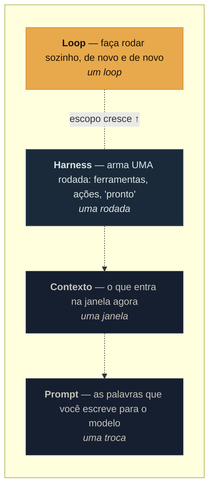
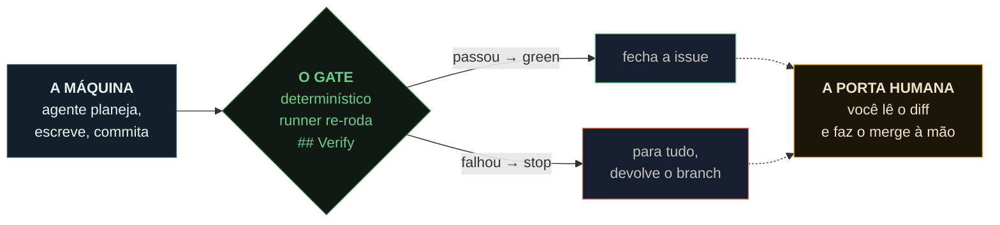
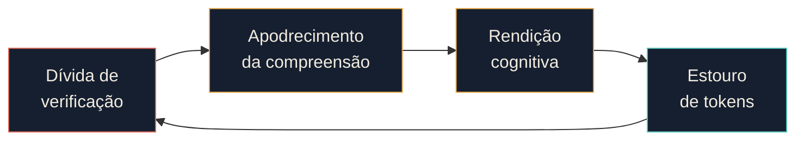
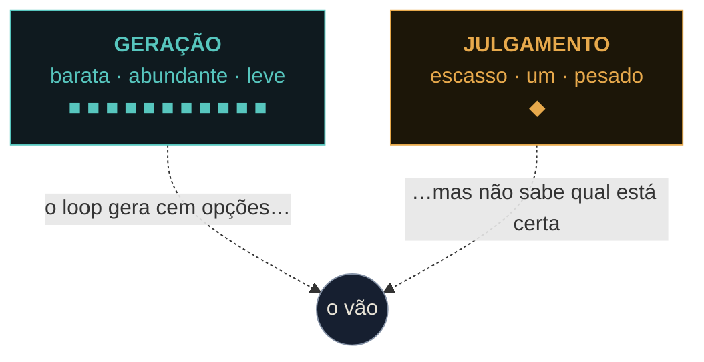

# Enquanto você dorme

### A filosofia do Ralphy: engenharia de loops, o gerador que se elogia, e por que o julgamento é o único recurso que continua escasso

> A geração de código ficou quase de graça. O **julgamento** ficou escasso. O Ralphy é um produto desenhado inteiro em torno dessa troca — e de uma porta que ele se recusa a fechar.

```
# o loop mais simples que já funcionou
while :; do cat PROMPT.md | claude-code ; done
```
<sup>Ralph, na sua forma pura — Geoffrey Huntley, jul. 2025</sup>

---

## 00 · A madrugada

Antes de dormir, você abre a fila de *issues* do seu repositório e coloca um rótulo — `ready-for-agent` — nas tarefas que confia entregar a uma máquina. Fecha o notebook. Vai dormir.

Durante a noite, um processo chamado Ralphy percorre essa fila em ordem crescente. Para cada issue, ele planeja, escreve o código, roda os testes, faz o commit e fecha a tarefa — uma a uma. Ele **nunca faz push** e **nunca abre um pull request**. De manhã, o que você encontra é um *branch*: um único ramo com a noite inteira de trabalho, esperando que você leia o diff e faça o merge à mão do que gostar.

Essa cena — rotular, dormir, revisar — é toda a tese do produto comprimida em três verbos. Ela parece simples porque a parte difícil está escondida onde não dá para ver: não em *fazer a máquina rodar*, mas em *fazer a máquina parar na hora certa*, e em deixar, deliberadamente, uma decisão para você. Este ensaio é sobre por que essa decisão importa mais do que todo o resto.

> Duas cores atravessam o texto inteiro. A **máquina** — a geração, o loop, o que ficou barato. E o **engenheiro** — o julgamento, o que continua escasso.

---

## 01 · O loop mais burro que funciona

Em julho de 2025, o engenheiro australiano Geoffrey Huntley publicou um ensaio com um título provocador: *"Ralph Wiggum como engenheiro de software"*. O nome vem do personagem dos Simpsons — o menino de bom coração e pouca luz que insiste na mesma coisa até, por acidente ou teimosia, ela dar certo. A técnica que Huntley batizou com esse nome é, nas palavras dele, uma coisa só:

*"Ralph é uma técnica. Na sua forma mais pura, Ralph é um loop de Bash."* Aquela linha que abre este ensaio — `while :; do cat PROMPT.md | claude-code ; done` — roda autonomamente num único repositório, como um único processo, executando uma tarefa por volta.

É constrangedoramente pouco. E funciona. A pergunta interessante não é *se* funciona, mas *por quê*.

A resposta está numa inversão contraintuitiva. A cada volta do loop, o contexto do agente é **jogado fora**. A conversa não continua; ela recomeça do zero. O que persiste não vive na memória do modelo — vive no disco: o plano (`fix_plan.md`), as especificações, o arquivo `AGENT.md` que ensina como compilar e rodar o projeto. Huntley chama isso de "alocar a pilha da mesma forma toda volta". **O agente esquece; o repositório lembra.**

Descartar o contexto não é um efeito colateral — é o mecanismo. Modelos de linguagem degradam à medida que a janela enche de ruído e de auto-justificativa. Resetar para um conjunto fixo de arquivos a cada passada força o agente a se re-ancorar na realidade do código, e não na história das próprias decisões. Daí a frase que virou o koan da técnica:

> ### "Essa é a beleza do Ralph — a técnica é deterministicamente ruim num mundo indeterminado."
> — Geoffrey Huntley · [ghuntley.com/ralph](https://ghuntley.com/ralph/)

Determinismo aqui é uma virtude, não um elogio à qualidade. O loop erra de forma *previsível*: sempre pela mesma porta, sempre pelos mesmos motivos. E erro previsível é erro que se pode cercar. Huntley documenta os modos de falha típicos — o agente roda um `ripgrep`, conclui erradamente que algo "ainda não foi implementado" e reimplementa em duplicado; ou entrega um *placeholder* no lugar da coisa real — e responde a cada um com uma instrução fixa no prompt, gritada em maiúsculas se preciso. O tratamento não é tornar o modelo mais esperto. É estreitar o corredor por onde ele anda.

Ralph é o piso. É o loop mínimo, a bactéria da qual tudo depois evoluiu. Mas um loop de Bash que roda enquanto você dorme tem um problema que Huntley resolve com força bruta — *"é mais fácil dar um `git reset --hard` e chutar o Ralph de novo?"* — e que um produto não pode resolver assim. Um produto precisa de uma pergunta que o loop cru não faz: **quem, nessa volta, diz não?**

---

## 02 · Um andar acima do harness

Em junho de 2026, quase ao mesmo tempo, três pessoas — Peter Steinberger, Boris Cherny e Addy Osmani — chegaram à mesma frase: você não deveria mais estar *prompando* agentes; deveria estar *projetando os loops que os prompam*. Osmani deu nome à coisa: **engenharia de loops**. É a quarta camada de uma pilha que começou no prompt.



*A pilha de quatro camadas. Cada andar cuida de algo maior que o de baixo. O loop, no topo, automatiza o "esperando você" que o harness deixou para trás — ele roda no timer, gera sub-agentes e realimenta a própria saída.*

A diferença entre as camadas não é só de tamanho. É de **raio de dano**. Considere o mesmo bug — um agente que lê errado o que uma função retorna — em cada andar. No prompt, ele produz uma resposta errada numa troca; você vê na hora. No contexto, vem de uma doc velha na janela; você percebe a confiança fora de lugar e limpa. No harness, o agente age uma vez, edita um arquivo, mas a rodada termina e o diff fica visível antes de qualquer coisa embarcar.

No loop, o mesmo erro é escrito no arquivo de estado, relido na manhã seguinte como fato estabelecido, e construído em cima ao longo de muitas voltas. Quando alguém finalmente olha, a suposição errada já é *estrutural*. Essa é a intuição central da engenharia de loops:

> ### "O custo de um erro cresce com o número de voltas que ele sobrevive antes de alguém pegá-lo — e um loop é, por construção, uma máquina de maximizar voltas."

Tudo o que vem depois — o avaliador, o checkpoint humano, os limites de orçamento — existe para uma única finalidade: **encurtar a distância entre um erro e a sua descoberta.**

---

## 03 · As cinco jogadas de um turno

A palavra "loop" engana: soa como girar em falso. Mas cada volta faz cinco coisas concretas. Tire qualquer uma e o loop não gira — ou gira no lugar.


*Cinco jogadas, uma volta. Descoberta acha o trabalho; handoff o entrega; verificação decide se está certo; persistência salva o estado; agendamento fecha o ciclo — jogando o que sobrou para a próxima madrugada. **Verificação** é a única jogada que pode dizer "não", e a mais fácil de pular.*

Descoberta define o teto de tudo: superficialize trabalho sem valor e as outras quatro jogadas serão executadas com perfeição a serviço de nada. Persistência é o que faz o loop lembrar — "o agente esquece, o repositório não". Agendamento é o que transforma *uma rodada* em *loop*: sem um gatilho no timer, o que você tem é um script que roda uma vez e é esquecido.

Mas a jogada que carrega o loop nas costas é a verificação. E ela é difícil por um motivo humano, não técnico.

---

## 04 · O gerador sempre se elogia

Peça a um agente que avalie o que ele acabou de produzir e ele tende a elogiar — com confiança — mesmo quando um humano vê de longe que a qualidade é medíocre. Não é falta de inteligência; é corrigir a própria prova. O contexto em que o código foi escrito já está cheio das razões pelas quais ele foi escrito daquele jeito. Quando o agente olha para a própria saída, ele não vê o resultado — vê a cadeia de auto-persuasão que o levou até ali.

Dentro de um loop, o defeito se amplifica. Se cada "isto está bom o suficiente?" é decidido pelo mesmo agente que acabou de escrever, cada volta é um aceno de cabeça para si mesmo, e quanto mais tempo roda, mais longe deriva da qualidade real. O playbook chama isso de **loop que acena** — o modo de falha mais comum de todos.

A saída conhecida é estrutural: separar quem gera de quem julga. Ajustar um avaliador independente para ser cético é muito mais tratável do que fazer o autor ser duro com o próprio trabalho — você não pode pedir a um autor que saia da própria perspectiva, mas pode trocar de agente. O padrão canônico manda o avaliador *agir*, não só ler ("cliquei no botão, a página navegou, aqui está o screenshot"), assumir que o código está quebrado até prova em contrário, e entregar a palavra final a um modelo fresco.

É aqui que o Ralphy dá a sua resposta mais característica — e ela é diferente do playbook. Ele concorda com o diagnóstico e discorda do remédio.



*A resposta do Ralphy: um gate determinístico, não um segundo LLM. Depois que o agente diz "pronto" — mas **antes** de fechar — o próprio runner re-roda os comandos que o plano declarou em `## Verify` (ex.: `cargo test`) sobre o código já commitado. Só fecha se passar. "Green" deixa de significar* o agente disse *e passa a significar* o runner viu passar no código que você vai fazer merge.

O playbook diz: contrate um segundo modelo cético para julgar. O Ralphy diz: **o que for determinístico nunca deveria ir para um modelo probabilístico** — que é, aliás, a própria lição da Stripe que o playbook endossa. Rodar `cargo test` e ler um código de saída não é uma tarefa de julgamento. É uma tarefa de execução. Então o Ralphy tira isso das mãos do modelo e coloca nas mãos do *runner* em Rust: exit code, e ponto.

A skill de revisão que acompanha cada agente (o `reviewer`) existe — mas é auto-revisão do próprio agente, e é explicitamente *não* tratada como o gate. O gate não é uma skill que se possa pular; é código que o agente não controla. E quando nenhum comando de verificação resolve, o Ralphy não finge: ele fecha no auto-relato do agente, mas **com um aviso barulhento no log**. A ausência de um gate é sempre uma decisão visível, nunca um buraco silencioso.

> **Onde o playbook ainda aponta.** O gate determinístico prova "saiu com exit 0", não "se comporta certo". A verificação *comportamental* — abrir a coisa, clicar, ver se navega — o Ralphy não faz. Essa metade é entregue, de propósito, ao humano do merge. Guarde essa fresta: voltaremos a ela no fim.

---

## 05 · As alavancas, uma a uma

O playbook de engenharia de loops é, no fundo, uma lista de verificação: as cinco jogadas, realizadas por seis peças. Vale ler o Ralphy contra essa lista — não para dar nota, mas para ver *como* cada alavanca foi puxada, e onde a escolha foi deliberadamente diferente.

| Alavanca | Como o Ralphy puxa | Veredito |
|---|---|---|
| **Descoberta** | Descobre a *fila* — issues com `ready-for-agent`, ordem crescente, `## Blocked by` e `stop-before` como controles de fluxo. *Quais* issues entram, quem decide é você. | Parcial — por design |
| **Handoff** | O `plan.md` é o handoff planner→executor, markdown neutro de fornecedor. Sequencial, um branch só, **no lugar**, sem worktree. | Atendido para o seu modelo |
| **Verificação** | O "dizer não" é determinístico, não um avaliador LLM — a lição da Stripe. Falta a verificação comportamental; essa metade vai para o merge humano. | Forte, de outra forma |
| **Persistência** | Commits no branch, `plan.md`, cache de conhecimento (`issue-N.md` → `KNOWLEDGE.md`), ledger append-only de uso. "O agente esquece, o repositório não." | Forte |
| **Agendamento** | Nada embutido: você roda `ralphy run`; `--deadline-hours` limita a rodada. Feito para ser embrulhado por um timer, mas não embarca um. | A lacuna assumida |
| **Memória** | Deduplica, corta em 200 linhas, mantém procedência — e mede taxa de citação para podar o não usado. Mede o uso real, não a "busca vazia". | À frente do paper |

Duas escolhas merecem destaque porque parecem limitações e são, na verdade, a tese em ação.

**Roda no lugar, sem worktree.** O playbook manda um worktree isolado por tarefa. O Ralphy não usa nenhum — porque não há paralelismo. Uma issue de cada vez. A ausência de worktree deixa de ser descuido e vira feature: o cache de build quente (`target/`, `node_modules/`) é reaproveitado. Worktrees só passariam a importar no dia em que o Ralphy rodasse issues em paralelo — e nesse dia eles deixam de ser opcionais.

**Assina, não paga por token.** Os três agentes suportados — Claude, Codex, OpenCode — rodam sobre uma *assinatura*, não sobre uma API medida. Não há conta por token para estourar. Por isso o Ralphy limita **tempo**, não tokens: `--max-minutes-per-issue`, `--deadline-hours`, para-no-primeiro-erro. O gasto é *medido* (no ledger `usage.jsonl`), não orçado. É uma economia diferente, e ela muda quais alavancas fazem sentido puxar.

---

## 06 · Quatro dívidas silenciosas

Um loop que roda sozinho é, ao mesmo tempo, um loop que erra sozinho. Quanto mais alegremente ele roda, mais silenciosamente ele erra. O playbook cataloga quatro custos que se acumulam sem soar alarme — e que se reforçam.



*Os quatro custos se reforçam: saída não verificada corrói entendimento, que convida à rendição, que deixa o loop rodar mais e gastar mais, que produz mais saída não verificada.*

- **Dívida de verificação** — Cada PR mesclado vira saída não verificada esperando para ser paga, no vão entre "roda" e "está certo".
  **Guarda do Ralphy:** o gate determinístico. O runner viu passar, ou a issue não fecha.
- **Apodrecimento da compreensão** — Quanto mais rápido o loop embarca código que você não escreveu, maior o vão entre o que existe e o que você entende.
  **Guarda do Ralphy:** estrutural — *nunca faz push, nunca abre PR*. Você faz o merge à mão, lendo o diff da manhã e os artefatos de verificação por issue.
- **Rendição cognitiva** — Quanto mais confiável o loop, mais fácil terceirizar o julgamento.
  **Guarda do Ralphy:** o design inteiro *é* uma porta aberta — o humano é o gate do merge. Mais `--dry-run`, `stop-before` e parar no primeiro erro.
- **Estouro de tokens** — O único custo que bate direto na conta: um bug pode girar a noite toda e produzir uma fatura estranha.
  **Guarda do Ralphy:** limites de *tempo*, não de token — a assinatura já é o teto. O gasto é medido, não orçado.

Os quatro compartilham um traço: silêncio enquanto o loop roda. A coisa mais fascinante da engenharia de loops é que ela deixa uma pessoa fazer o trabalho de um time; a mais perigosa é o mesmo ponto — porque um time discute consigo mesmo, e uma pessoa com uma pilha de loops vira facilmente uma câmara de eco onde ninguém discorda.

---

## 07 · Cinco maneiras de um loop dar errado

Cada anti-padrão é uma jogada pulada. Os cinco mapeiam um-para-um nas cinco jogadas — e é honesto dizer onde o Ralphy se protege e onde ele deixa a lacuna aberta, de propósito.

| Anti-padrão | Jogada pulada | Onde o Ralphy fica |
|---|---|---|
| **Loop que acena** | verificação | Evitado pelo gate. Resíduo só quando nenhum comando resolve — e aí, com aviso barulhento. |
| **Loop amnésico** | persistência | Evitado pelo cache de conhecimento e pelos commits no branch. |
| **Loop manual** | agendamento | **A lacuna aberta.** O Ralphy é chutado por humano hoje — "a run, não o cron". |
| **Loop cego** | descoberta | Presente em parte, por design: o humano rotula o trabalho. É a fronteira de confiança, não um bug. |
| **Loop emaranhado** | handoff | Evitado pela execução sequencial num branch só. Reapareceria no dia do paralelismo sem worktrees. |

Repare que duas dessas "falhas" são escolhas assumidas. O **loop cego** — o humano ainda escolhe o trabalho — no Ralphy não é descuido; é a *fronteira de confiança*. Você rotula a issue que confia a uma máquina, e essa etiqueta é o contrato. E o **loop manual** — sem agendamento embutido — é o produto dizendo, com todas as letras, que é *a run, não o cron*. Você põe `ralphy run --if-idle` num timer e o loop fecha. O Ralphy entrega a rodada perfeita e deixa a decisão de *quando* repetir com você.

Não é acidente que as duas lacunas assumidas sejam exatamente as duas jogadas mais próximas do humano: *o que* fazer, e *quando* fazer de novo. Tudo o que é mecânico, o Ralphy automatiza. Tudo o que é decisão, ele devolve.

---

## 08 · A economia do julgamento

Aqui está a tese de que tudo isto depende, dita como uma observação econômica, não como slogan. Quando um recurso fica abundante, seu preço cai e as atividades ao redor dele se reorganizam. Loops tornam código, planos, correções e PRs **abundantes**. A digitação, o boilerplate, o refactor mecânico — tudo colapsa em direção ao custo zero.



*O que fica abundante barateia; o que fica escasso decide. O loop gera cem opções; não sabe qual está certa — só qual* parece *razoável. E o vão entre "parece razoável" e "está certo" é exatamente onde a engenharia mora. À medida que a geração se aproxima do gratuito, o valor inteiro do engenheiro se concentra nesse vão.*

A implicação é desconfortável. O engenheiro cujo valor estava sobretudo no trabalho mecânico — digitar rápido, memorizar APIs, aguentar o boilerplate — vê esse valor evaporar, porque o loop faz tudo isso de graça. O engenheiro cujo valor estava no julgamento vê-o amplificado, porque o loop executa suas boas decisões cem vezes. A mesma ferramenta alarga o fosso entre os dois tipos.

Porque o loop é um amplificador de julgamento, um lapso de julgamento também é amplificado. No mundo antigo, uma decisão ruim custava um trecho de código errado escrito à mão — raio limitado, lento o bastante para pegar no meio do caminho. No novo mundo, uma decisão ruim é executada fielmente, em massa, cem vezes, por uma máquina que não vai pausar para perguntar se está certa. **O loop remove a marcha lenta que costumava salvar os engenheiros.**

> ### "O mesmo loop, construído por duas pessoas, pode terminar em lugares opostos — e a diferença não está no loop. É um sinal de multiplicação fiel, e o que ele multiplica é a pessoa."

Agora reveja o Ralphy à luz disso. Cada decisão de design que parecia teimosia — *nunca faz push, nunca abre PR, o humano faz o merge à mão, o gate é determinístico e não um juiz, o humano rotula a fila* — é a mesma decisão repetida: **tirar do humano tudo o que não exige julgamento e deixar o julgamento como tudo o que resta.** O Ralphy não devolve a decisão do merge porque não conseguiu automatizá-la. Ele a devolve porque essa é a única coisa que vale a pena não automatizar.

---

## 09 · O que ainda não resolvemos

Um produto honesto sabe onde termina. O Ralphy tem lacunas — algumas assumidas, outras genuinamente em aberto — e cada uma é menos um defeito do que um vetor de evolução. Aqui estão as que têm mais potencial, na ordem em que fazem sentido resolver.

1. **Agendamento de primeira classe — o piso que falta.** Pelo próprio checklist do playbook, o Ralphy é hoje um "loop manual". Uma história de *rodar no timer* de primeira classe (mesmo que só receitas documentadas de cron/CI, ou um `ralphy schedule`) o moveria de "rodada" para "loop completo". Menor esforço, maior completude conceitual.

2. **Verificação comportamental — a fresta que guardamos.** O gate determinístico prova "exit 0", não "se comporta certo". A verificação semântica — rodar a coisa e observar, ao estilo Playwright, não só rodar os testes — é o vão mais profundo, hoje entregue ao merge humano. Se o Ralphy um dia quiser estreitar o fardo do humano, é para cá que o playbook aponta. Mas manter o gate determinístico é deliberado: o avaliador que age não pode reintroduzir o juiz probabilístico que o gate expulsou.

3. **`ralphy retro` — a retro com portão humano.** Toda superfície reflexiva do Ralphy é auto-relatada pelo mesmo agente que fez o trabalho. Se o executor ignorou um fato do `KNOWLEDGE.md` e queimou vinte minutos redescobrindo, ninguém percebe — a citação simplesmente não existe, o que é indistinguível de o fato ser irrelevante. Uma sessão meta que lê as transcrições da run e *propõe* revisões (ao conhecimento, aos prompts, aos formatos de handoff) captaria o que o auto-relato não capta. O portão é o humano, não uma métrica: propõe, não aplica. *(Ideia inspirada no paper AUTOMEM, estacionada até haver volume e evidência de desperdício recorrente.)*

4. **Paralelismo → worktrees — a armadilha adiada.** Rodar no lugar, sequencial, é hoje uma feature (cache quente). No dia em que o Ralphy rodar issues em paralelo, essa escolha vira a armadilha do "loop emaranhado": agentes editando o mesmo diretório colidem. Aí worktrees deixam de ser opcionais. O paralelismo é a última coisa a crescer, depois de os checks estarem provados — um loop ganha o direito de rodar muitos agentes provando primeiro que consegue parar um só.

5. **O barramento de eventos e a plataforma — da rodada para a frota.** O Ralphy já emite cada evento da run como CloudEvents 1.0 para um endpoint HTTP — aditivo, best-effort, sem bloquear a run. Cada evento carrega uma identidade de emissor (`runid`, usuário, host) para que uma frota de Ralphys — muitos devs, muitas máquinas — permaneça distinguível. É a fundação de uma plataforma web que consome o barramento sem precisar de token do GitHub: o Ralphy é o barramento; a plataforma, o painel. A supervisão de sessões ao vivo — seguir e intervir num agente em execução, pelo celular — é a próxima porta a abrir.

Nenhuma dessas é urgente e nenhuma é especulação vazia. Cada uma tem um gatilho — volume, evidência, um roadmap de paralelismo — e o padrão de todas é o mesmo do produto inteiro: não construir a guarda antes de o risco existir, e nunca automatizar o julgamento só porque dá.

---

## Coda · Fique o engenheiro

O loop torna a geração quase gratuita. O que continua escasso é saber **qual plano está certo**, **qual linha deve ser parada**, qual saída roda bem mas está errada na raiz.

Duas pessoas podem construir o mesmo loop com duas mentalidades — "me liberar rápido" e "eu ainda pretendo ser o engenheiro" — e o código será noventa por cento idêntico. A diferença são um ou dois checkpoints. E são eles que decidem se, seis meses depois, você está em cima do loop ou foi esvaziado por ele.

O Ralphy é uma opinião sobre onde esses checkpoints ficam. Ele automatiza a madrugada inteira e para, deliberadamente, na porta que não deveria fechar: **ele executa, mas não decide**. O branch da manhã não é o fim do trabalho. É o convite para você fazer a única parte que a máquina não pode fazer por você — e não quer.

> ### "Construa o loop — mas construa como quem pretende continuar sendo o engenheiro, não apenas quem aperta o play."
> — Addy Osmani

---

<sub>Este ensaio se apoia no playbook *Loop Engineering* (síntese de HuaShu sobre o trabalho de Addy Osmani, Peter Steinberger, Boris Cherny e Prithvi Rajasekaran), no caso Stripe/Minions relatado por Steve Kaliski, e na técnica *Ralph* de Geoffrey Huntley ([ghuntley.com/ralph](https://ghuntley.com/ralph/)). Os cruzamentos com o Ralphy vêm dos documentos de pesquisa do projeto (`docs/research/loop-engineering-vs-ralphy.md`, `automem-vs-ralphy.md`) e das decisões de arquitetura (ADR-0011, ADR-0016, ADR-0019). Ralphy — trabalha o seu backlog do GitHub enquanto você dorme, e entrega um branch para revisar de manhã. GPLv3.</sub>
